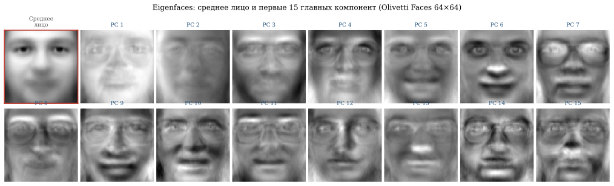
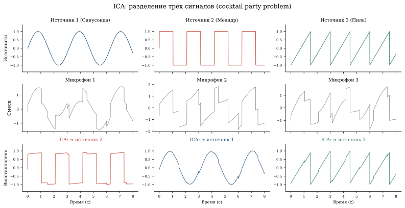
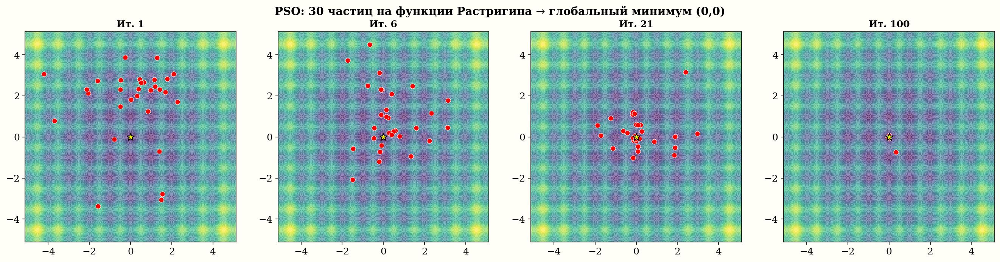

```{=html}
<style>
  /* На лендинге свой герой-блок — дефолтный заголовок Quarto прячем. */
  #title-block-header.quarto-title-block { display: none; }
</style>
<section class="sigma-hero">
  <span class="sigma-hero-sigma">Σ</span>
  <h1 class="sigma-hero-title">Сигма</h1>
  <p class="sigma-hero-sub">
    Интерактивный учебник по математике современного ИИ. Каждая страница —
    история, формула и работающий код прямо в браузере.
  </p>

  <div class="sigma-hero-cards">
    <a class="sigma-story-card" href="story_pca.html">
      
      <div class="sigma-story-card-body">
        <span class="sigma-story-card-badge">▶ Поиграть</span>
        <div class="sigma-story-card-title">Eigenfaces и сжатие</div>
        <div class="sigma-story-card-desc">Лицо как сумма «собственных лиц». Двигайте число компонент — смотрите, как оно собирается.</div>
      </div>
    </a>
    <a class="sigma-story-card" href="story_fft_matrix.html">
      
      <div class="sigma-story-card-body">
        <span class="sigma-story-card-badge">▶ Поиграть</span>
        <div class="sigma-story-card-title">Спектр звука и Shazam</div>
        <div class="sigma-story-card-desc">ДПФ как умножение на матрицу: разложите два тона и постройте спектрограмму.</div>
      </div>
    </a>
    <a class="sigma-story-card" href="story_eigenvalues.html">
      
      <div class="sigma-story-card-body">
        <span class="sigma-story-card-badge">▶ Поиграть</span>
        <div class="sigma-story-card-title">Резонанс и мост Такома</div>
        <div class="sigma-story-card-desc">Собственные частоты от PageRank до рухнувшего моста. Поймайте резонанс сами.</div>
      </div>
    </a>
    <a class="sigma-story-card" href="story_ica.html">
      
      <div class="sigma-story-card-body">
        <span class="sigma-story-card-badge">▶ Поиграть</span>
        <div class="sigma-story-card-title">Коктейльная вечеринка</div>
        <div class="sigma-story-card-desc">Три микрофона, три голоса. ICA разбирает смесь на независимые источники.</div>
      </div>
    </a>
    <a class="sigma-story-card" href="story_global_optim.html">
      
      <div class="sigma-story-card-body">
        <span class="sigma-story-card-badge">▶ Поиграть</span>
        <div class="sigma-story-card-title">Муравьи, рой и отжиг</div>
        <div class="sigma-story-card-desc">Метаэвристики против коммивояжёра — и та же «температура», что в LLM.</div>
      </div>
    </a>
    <a class="sigma-story-card" href="story_double_descent.html">
      
      <div class="sigma-story-card-body">
        <span class="sigma-story-card-badge">▶ Поиграть</span>
        <div class="sigma-story-card-title">Двойной спуск</div>
        <div class="sigma-story-card-desc">Почему сети с триллионом параметров не переобучаются. Крутите степень полинома.</div>
      </div>
    </a>
  </div>
</section>
<style>
  .sigma-tree { margin: 1.2em 0 2em; font-family: et-book, Palatino, Georgia, serif; }
  .sigma-tree h2 { margin: 0 0 0.4em; font-size: 1.5em; }
  .sigma-tree .lede { color: #555; font-size: 0.95em; margin-bottom: 1em; max-width: 56ch; }
  .sigma-tree .legend { color: #777; font-size: 0.85em; margin-bottom: 1em; }
  .sigma-tree details { margin: 0; padding: 0; }
  .sigma-tree > details {
    border-left: 2px solid #c8c2a8;
    padding: 0.05em 0 0.05em 0.9em;
    margin: 0 0 0.25em 0;
  }
  .sigma-tree > details[open] { border-left-color: #7253ED; }
  .sigma-tree details details {
    border-left: 1px solid #e0dcc8;
    padding: 0 0 0 0.9em;
    margin: 0 0 0 0.3em;
  }
  .sigma-tree details details[open] { border-left-color: #b8a8e8; }
  .sigma-tree summary {
    cursor: pointer;
    list-style: none;
    padding: 0.12em 0.25em;
    border-radius: 3px;
    user-select: none;
    line-height: 1.35;
  }
  .sigma-tree summary::-webkit-details-marker { display: none; }
  .sigma-tree summary::before {
    content: "▸";
    display: inline-block;
    width: 1em;
    color: #b0a890;
    font-size: 0.85em;
    transition: transform 0.12s ease;
  }
  .sigma-tree details[open] > summary::before {
    transform: rotate(90deg);
    color: #7253ED;
  }
  .sigma-tree > details > summary {
    font-weight: 600;
    font-size: 1.08em;
    color: #1d1d1f;
  }
  .sigma-tree details details > summary { font-size: 0.98em; color: #2d2d31; }
  .sigma-tree details details > summary:hover { background: #fff5d8; }
  .sigma-tree summary a { color: inherit; text-decoration: none; }
  .sigma-tree summary a:hover { color: #7253ED; text-decoration: underline; }
  .sigma-tree .desc {
    margin: 0.15em 0 0.35em 0;
    padding: 0 0.4em 0 2em;
    color: #4a4a52;
    font-size: 0.93em;
    line-height: 1.55;
    max-width: 60ch;
  }
  .sigma-tree .tag {
    display: inline-block;
    font-size: 0.68em;
    padding: 0.05em 0.45em;
    margin-left: 0.45em;
    border-radius: 3px;
    background: #ece8d4;
    color: #6a5a30;
    font-weight: 500;
    font-family: ui-sans-serif, system-ui, sans-serif;
    vertical-align: 1px;
  }
  .sigma-tree .tag.new   { background: #ffe79a; color: #7a5500; }
  .sigma-tree .tag.star  { background: #efe0fa; color: #5a2da3; }
  .sigma-tree .tag.armen { background: #d8eafc; color: #1c4f8a; }
  .sigma-tree .tag.daniil{ background: #fad7d8; color: #8a2628; }
  .sigma-tree .controls { font-size: 0.85em; color: #777; margin: 0 0 0.8em; }
  .sigma-tree .controls a { color: #7253ED; cursor: pointer; margin-right: 0.7em; text-decoration: none; }
  .sigma-tree .controls a:hover { text-decoration: underline; }
</style>

<section class="sigma-tree">

<h2>О чём книга</h2>

<p class="lede">Пять частей, один сквозной рассказ. Каждая страница — история, формула и работающий код. Раскройте часть, чтобы увидеть её страницы.</p>

<p class="controls">
<a onclick="document.querySelectorAll('.sigma-tree details').forEach(d=>d.open=true)">раскрыть всё</a>
<a onclick="document.querySelectorAll('.sigma-tree details').forEach(d=>d.open=false)">свернуть всё</a>
</p>

<details>
<summary><a href="ch01_intro.html">Часть I. Введение в ИИ</a></summary>

<details>
<summary><a href="ch01_intro.html">Что такое искусственный интеллект</a></summary>
<div class="desc">Откуда взялась идея «думающей машины»: от Тьюринга и Дартмутского семинара до нынешних больших моделей. Зачем для понимания ИИ нужна именно математика — оптимизация, линейная алгебра, вероятность — и что мы пройдём дальше по книге.</div>
</details>

</details>

<details>
<summary>Часть II. Оптимизация</summary>

<details>
<summary><a href="story_loss_landscape.html">Ландшафт функции потерь <span class="tag new">сюжет</span></a></summary>
<div class="desc">Веса сети — точка в $\mathbb{R}^d$, $d$ до миллиардов. Проецируем потери на случайную плоскость и видим «карту высот»: ResNet без skip-connections хаотичен, с ними — гладкая долина. Парадоксы размерности: почти все критические точки — сёдла, объём шара уходит в корку, расстояния концентрируются. Виджет: крутите проекцию.</div>
</details>

<details>
<summary><a href="ch02_newton.html">Метод Ньютона</a></summary>
<div class="desc">Метод касательных: вместо линейной аппроксимации — квадратичная, минимум параболы и есть следующий шаг. Сходимость квадратичная — число точных знаков удваивается за итерацию. Школьник проверяет руками: $f(x)=x^2-2$, корень $\sqrt 2$ за 4 шага. Отсюда — Ньютон-Канторович, корни уравнений и квазиньютоновские методы.</div>
</details>

<details>
<summary><a href="story_global_optim.html">Глобальная оптимизация: муравьи, рой, отжиг <span class="tag new">сюжет</span></a></summary>
<div class="desc">Когда градиента нет или ям много: имитация отжига с формулой Метрополиса $\exp(-\Delta E/T)$, роевой интеллект (PSO), муравьиные феромоны, генетика против коммивояжёра. Та же «температура» $T$ всплывает в softmax больших моделей: $T\to0$ — жадный argmax, $T>1$ — креатив. Виджет: ловите глобальный минимум.</div>
</details>

<details>
<summary><a href="story_mds.html">Многомерное шкалирование и проклятие размерности <span class="tag new">сюжет</span></a></summary>
<div class="desc">Дана таблица расстояний — восстановите координаты, минимизируя стресс. На этой задаче видно превосходство методов первого порядка: точный градиент сходится за секунды, а безградиентные платят фактор размерности $d$ и при $d=50$ не сходятся. Почему сети с $10^{11}$ параметров учат градиентом, а не перебором.</div>
</details>

<details>
<summary><a href="story_double_descent.html">Феномен двойного спуска <span class="tag new">сюжет</span></a></summary>
<div class="desc">Классика обещает U-образную ошибку (bias-variance). Белкин, 2019: за порогом интерполяции $p=n$ ошибка снова падает — двойной спуск. При $p\gg n$ выбирается решение минимальной нормы, неявная регуляризация даёт гладкость и хорошее обобщение. Почему модели с триллионом параметров не переобучаются. Виджет: степень полинома от 1 до 80.</div>
</details>

</details>

<details>
<summary><a href="ch_linalg.html">Часть III. Линейная алгебра и данные</a></summary>

<details>
<summary><a href="ch_linalg.html">Вычислительная линейная алгебра</a></summary>
<div class="desc">Когда арифметика лжёт (числа с плавающей точкой), SVD как главный фокус, теорема Эккарта–Янга о лучшем малоранговом приближении, eigencats и оценки липшицевости сети. Базовая глава Части III; eigenfaces и PageRank вынесены в отдельные сюжеты ниже.</div>
</details>

<details>
<summary><a href="story_pca.html">PCA и Eigenfaces <span class="tag new">сюжет</span></a></summary>
<div class="desc">Фотография лица — вектор из тысяч пикселей, но лица живут на тонком многообразии. PCA = собственное разложение ковариации; 50–80 «собственных лиц» покрывают 95% вариации. Лицо как короткий список коэффициентов. Виджет: двигайте число компонент, смотрите, как лицо собирается.</div>
</details>

<details>
<summary><a href="story_eigenvalues.html">Собственные значения: PageRank и шатающиеся мосты <span class="tag new">сюжет</span></a></summary>
<div class="desc">Одно уравнение $Av=\lambda v$ объясняет ранжирование Google и крах моста Такома. PageRank: стационарное распределение случайного сёрфера = собственный вектор при $\lambda=1$ (Перрон–Фробениус), степенной метод. Мост: собственные частоты, резонанс. Виджет: поймайте резонанс сами.</div>
</details>

<details>
<summary><a href="story_ica.html">ICA и задача коктейльной вечеринки <span class="tag new">сюжет</span></a></summary>
<div class="desc">Три микрофона, три голоса, каждый слышит смесь $x=As$. Найти $W\approx A^{-1}$ и восстановить голоса. PCA делает компоненты некоррелированными, ICA — независимыми: ищем максимально негауссовы направления (FastICA). Очистка ЭЭГ, fMRI, рыночные факторы. Виджет: разберите смесь.</div>
</details>

<details>
<summary><a href="story_word2vec.html">Word2Vec: слова как векторы <span class="tag new">сюжет</span></a></summary>
<div class="desc">Каждое слово — вектор; слова с похожим контекстом оказываются рядом. Семантика становится геометрией: король − мужчина + женщина ≈ королева. Дистрибутивная гипотеза, skip-gram, мост к BERT и GPT. Виджет: арифметика смыслов в браузере.</div>
</details>

<details>
<summary><a href="story_fft_matrix.html">БПФ как умножение на матрицу: спектр звука и Shazam <span class="tag new">сюжет</span></a></summary>
<div class="desc">ДПФ — умножение на унитарную матрицу из корней единицы; БПФ факторизует её в $\log_2 n$ разреженных «бабочек». Shazam строит спектрограмму, хеширует пики в отпечаток и ищет по миллионам треков за миллисекунды. Та же математика в JPEG, MP3, Wi-Fi, MRI. Виджет: разложите два тона.</div>
</details>

</details>

<details>
<summary><a href="ch03_0_intro.html">Часть IV. Анализ данных и ИИ</a></summary>

<details>
<summary><a href="ch03_1_prosteyshie-primery-zadach-anali.html">Простейшие задачи и принцип максимума правдоподобия</a></summary>
<div class="desc">Опрос на втором туре выборов, асимптотика Фишера и Ле Кама, доверительные интервалы через Чебышёва и ЦПТ, оценка площади методом Монте-Карло, теорема Гаусса о том, почему симметричный шум обязан быть нормальным.</div>
</details>

<details>
<summary><a href="ch03_2_lineynaya-regressiya-i-metod-nai.html">Линейная регрессия и метод наименьших квадратов</a></summary>
<div class="desc">МНК как ОМП при гауссовом шуме, решение через принцип Ферма, два исторических примера: III закон Кеплера по данным Тихо Браге и ускорение свободного падения по данным Галилея. Множественная регрессия кратким обзором.</div>
</details>

<details>
<summary><a href="ch03_3_zadacha-klassifikacii-i-neyronny.html">Задача классификации и нейронные сети</a></summary>
<div class="desc">MNIST и UCI Digits, чем классификация отличается от регрессии, полносвязная сеть и кривые потерь, переобучение и U-образная кривая, теоремы об универсальной аппроксимации, свёрточные сети, градиентный спуск и обратное распространение ошибки.</div>
</details>

<details>
<summary><a href="ch03_4_zadachi-obucheniya-bez-uchitelya.html">Задачи обучения без учителя</a></summary>
<div class="desc">Задача Netflix и восстановление матрицы малого ранга, автокодировщики и их связь с PCA, эмбеддинги в современных моделях, сиамские сети и контрастивное обучение, SVD как общий язык.</div>
</details>

<details>
<summary><a href="ch03_5_kak-iskusstvennyy-intellekt-meny.html">Как ИИ меняет мир</a></summary>
<div class="desc">AlphaGo, революция трансформеров и ChatGPT, законы скейлинга в формулах, AlphaFold и Нобель-2024, рассуждения и вывод во время инференса, воплощённый ИИ, исчерпание данных, прогнозы о сингулярности и меняющийся ландшафт профессий.</div>
</details>

</details>

<details>
<summary><a href="ch04_0_intro.html">Часть V. Дискретная математика и криптография</a></summary>

<details>
<summary><a href="ch04_1_elementy-teorii-chisel.html">Элементы теории чисел</a></summary>
<div class="desc">Делимость и сравнения по модулю, алгоритм Евклида (обычный и расширенный), линейные сравнения, быстрое возведение в степень, функция Эйлера и малая теорема Ферма, проверка простоты и задача факторизации — фундамент для RSA.</div>
</details>

<details>
<summary><a href="ch04_2_shifrovanie-ot-taynopisi-k-matem.html">Шифрование: от тайнописи к математической задаче</a></summary>
<div class="desc">Зачем людям шифры, симметричная схема и её предел, революция открытого ключа 1976 года, односторонние функции и функции с секретом, где криптография работает прямо сейчас.</div>
</details>

<details>
<summary><a href="ch04_3_kriptosistemy-rsa-i-diffi-hellma.html">Криптосистемы RSA и Диффи–Хеллмана</a></summary>
<div class="desc">RSA: замок $N=pq$ кричишь в эфир, ключом владеешь только ты. Корректность и безопасность шифра, протокол Диффи–Хеллмана для обмена ключами, атака «человек посередине» и как от неё защищаются.</div>
</details>

<details>
<summary><a href="ch04_4_primeneniya-rsa-autentifikaciya.html">Применения RSA: подпись и голосование</a></summary>
<div class="desc">Аутентификация «докажи, что это ты», электронная цифровая подпись, схема электронного голосования — как одна и та же арифметика RSA даёт целый спектр протоколов доверия.</div>
</details>

<details>
<summary><a href="ch04_5_heshirovanie-teoriya-chisel-vstr.html">Хеширование: теория чисел встречается с рандомизацией</a></summary>
<div class="desc">Быстрый поиск и беда детерминированного хеширования, универсальное семейство хеш-функций и его конструкция через теорию чисел, маленькая хеш-таблица на пальцах, применения.</div>
</details>

<details>
<summary><a href="ch04_6_schetchiki-s-korotkoy-pamyatyu-h.html">Счётчики с короткой памятью: HyperLogLog</a></summary>
<div class="desc">Как посчитать число различных элементов почти без памяти: идея «самого длинного хвоста нулей», набор счётчиков, и неожиданный мост к эксперименту Стэнли Милгрэма о шести рукопожатиях.</div>
</details>

</details>

</section>

<script>
(function () {
  function loadOnce(href, attr) {
    return new Promise(function (res, rej) {
      if (document.querySelector('[' + attr + '="sigma-katex"]')) return res();
      var el;
      if (href.endsWith('.css')) {
        el = document.createElement('link');
        el.rel = 'stylesheet'; el.href = href;
      } else {
        el = document.createElement('script');
        el.src = href;
      }
      el.setAttribute(attr, 'sigma-katex');
      el.onload = res; el.onerror = rej;
      document.head.appendChild(el);
    });
  }
  function render() {
    var root = document.querySelector('.sigma-tree');
    if (!root || !window.renderMathInElement) return;
    window.renderMathInElement(root, {
      delimiters: [
        { left: '$$', right: '$$', display: true },
        { left: '$',  right: '$',  display: false }
      ],
      throwOnError: false,
      strict: false
    });
  }
  if (window.katex && window.renderMathInElement) { render(); return; }
  Promise.all([
    loadOnce('https://cdn.jsdelivr.net/npm/katex@0.16.11/dist/katex.min.css', 'data-sigma-katex-css'),
    loadOnce('https://cdn.jsdelivr.net/npm/katex@0.16.11/dist/katex.min.js', 'data-sigma-katex-js')
  ]).then(function () {
    return loadOnce('https://cdn.jsdelivr.net/npm/katex@0.16.11/dist/contrib/auto-render.min.js', 'data-sigma-katex-auto');
  }).then(render).catch(function (e) { console.warn('KaTeX load failed', e); });
})();
</script>
```

---

Учебник для тех, кто хочет глубже понять _математические основы_
современного искусственного интеллекта: оптимизацию, линейную
алгебру, анализ данных, криптографию.

## Как устроена книга

Источник — TeX-проект в Overleaf. По расписанию забираем ZIP, прогоняем
сборочный конвейер и публикуем три формата: PDF всей книги, HTML с живой
математикой, и отдельный PDF каждой главы. Поверх HTML — ИИ-ассистент,
который знает оглавление и текст глав.

```{=html}
<style>
  /* Mermaid в body-колонке: растянуть SVG, но не вылазить за её ширину */
  .cell-output-display figure.figure {
    display: block !important;
    margin: 0 !important;
  }
  .cell-output-display pre.mermaid {
    display: block !important;
    text-align: center;
  }
  .cell-output-display pre.mermaid > svg {
    width: 100% !important;
    max-width: 100% !important;
    height: auto !important;
    display: block;
    margin: 0 auto;
  }
  .mermaid .nodeLabel,
  .mermaid .edgeLabel,
  .mermaid foreignObject div,
  .mermaid foreignObject span {
    font-family: "et-book", Palatino, Georgia, serif !important;
    font-size: 15px !important;
    line-height: 1.35 !important;
  }
</style>
```

```{mermaid}
%%| fig-align: center
%%{init: {"flowchart": {"htmlLabels": true, "curve": "basis", "nodeSpacing": 30, "rankSpacing": 55, "padding": 12}, "themeVariables": {"fontSize": "15px", "fontFamily": "et-book, Palatino, Georgia, serif"}}}%%
flowchart TB
  OL["📘 <b>Overleaf MIPT</b> · главы .tex + рисунки<br/><i>источник истины</i>"]
  REPO["📦 <b>git-репозиторий</b> · <code>overleaf_export/</code>"]
  BUILD["⚙️ <b>scripts/build.sh</b><br/>latexmk · tex_to_qmd · split · augment · quarto"]
  NGINX["🌐 <b>nginx</b> · sigma.fmin.xyz"]

  R1["📕 <b>PDF</b><br/>всей книги"]
  R2["📄 <b>HTML</b><br/>+ KaTeX"]
  R3["📄 <b>PDF</b><br/>главы"]
  R4["🤖 <b>ИИ-ассистент</b><br/>чат + Pyodide"]

  OL -.->|"sync.sh — ZIP по cron"| REPO
  REPO --> BUILD
  BUILD --> NGINX
  NGINX --> R1
  NGINX --> R2
  NGINX --> R3
  NGINX --> R4

  classDef src fill:#fff3e0,stroke:#e65100,stroke-width:2px,color:#3e2723;
  classDef build fill:#e3f2fd,stroke:#1565c0,stroke-width:2px,color:#0d47a1;
  classDef hub fill:#fce4ec,stroke:#ad1457,stroke-width:2px,color:#880e4f;
  classDef out fill:#e8f5e9,stroke:#2e7d32,stroke-width:2px,color:#1b5e20;
  class OL,REPO src;
  class BUILD build;
  class NGINX hub;
  class R1,R2,R3,R4 out;
```

```{=html}
<div class="sigma-landing">
  <a class="sigma-pdf-btn" href="/book.pdf">📕 Скачать PDF всей книги</a>

  <div class="sigma-landing-assistant">
    <div class="sigma-landing-assistant-hint">
      Внизу справа на любой странице — ИИ-ассистент, который знает всю книгу.
      Можно спросить определение, попросить пример, построить график или
      разобрать формулу. Попробуйте:
    </div>
    <div class="sigma-landing-chips">
      <button class="sigma-landing-chip" data-q="Объясни SVD простыми словами">
        <span class="sigma-landing-chip-kind">📖 Объяснение</span>
        <span class="sigma-landing-chip-text">Объясни SVD простыми словами</span>
      </button>
      <button class="sigma-landing-chip" data-q="Построй график функции f(x) = x² − 2 и касательную к ней в точке x = 1.5">
        <span class="sigma-landing-chip-kind">📈 График</span>
        <span class="sigma-landing-chip-text">Метод Ньютона: график f(x)=x²−2 с касательной</span>
      </button>
      <button class="sigma-landing-chip" data-q="Как работает алгоритм RSA? Объясни на маленьком примере с числами.">
        <span class="sigma-landing-chip-kind">🔐 Разбор</span>
        <span class="sigma-landing-chip-text">Как работает RSA — на маленьких числах</span>
      </button>
      <button class="sigma-landing-chip" data-q="Чем нейронная сеть принципиально отличается от линейной регрессии?">
        <span class="sigma-landing-chip-kind">🤔 Сравнение</span>
        <span class="sigma-landing-chip-text">Нейросеть vs линейная регрессия</span>
      </button>
    </div>
  </div>
</div>

<script>
(function () {
  function bind() {
    var chips = document.querySelectorAll('.sigma-landing-chip');
    if (!chips.length) return;
    chips.forEach(function (btn) {
      btn.addEventListener('click', function () {
        var q = btn.getAttribute('data-q');
        if (!q) return;
        // Если ассистент уже подключился — даём ему через публичный API.
        if (window.sigmaAssistant && typeof window.sigmaAssistant.ask === 'function') {
          window.sigmaAssistant.ask(q);
          return;
        }
        // Иначе — ждём загрузки (defer + IIFE могут отстать).
        var tries = 0;
        var t = setInterval(function () {
          tries++;
          if (window.sigmaAssistant && typeof window.sigmaAssistant.ask === 'function') {
            clearInterval(t);
            window.sigmaAssistant.ask(q);
          } else if (tries > 50) {
            clearInterval(t);
            // Fallback — кликнуть лаунчер чтобы хотя бы открыть ассистента.
            var launcher = document.querySelector('.sigma-launcher');
            if (launcher) launcher.click();
          }
        }, 100);
      });
    });
  }
  if (document.readyState === 'loading') {
    document.addEventListener('DOMContentLoaded', bind);
  } else {
    bind();
  }
})();
</script>
```
