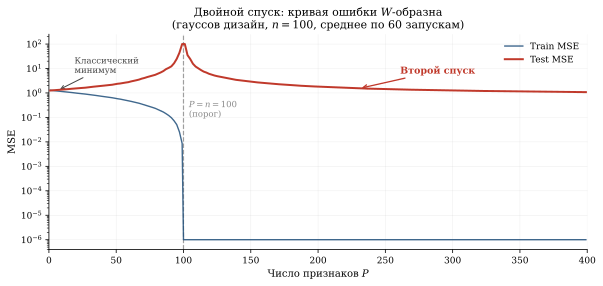
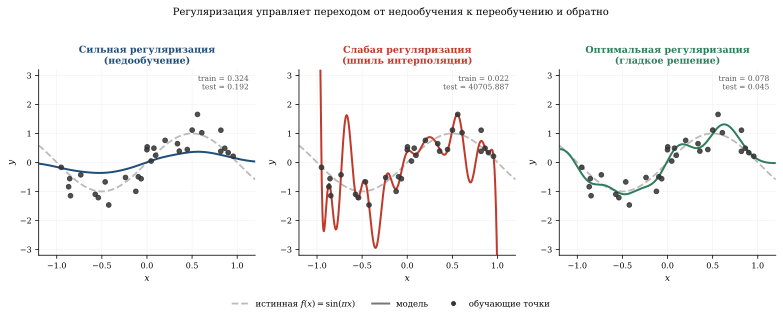

*Классическая статистика учит: увеличивай сложность модели — и ошибка на тесте сначала падает (модель учится), потом растёт (переобучение). Это U-образная кривая bias-variance tradeoff. Но в 2019 году Белкин показал, а Наккиран с коллегами подтвердили на нейросетях, что если продолжить увеличивать сложность дальше «точки переобучения», ошибка снова падает — и опускается **ниже** классического оптимума. Например, ResNet-18 на CIFAR-10 при критическом числе параметров выдаёт test error 25%, а при вдвое большей модели — ~8–10% (в зависимости от условий обучения). Это **двойной спуск** (double descent) — феномен, который ломает учебники.*

## Классический взгляд: bias-variance tradeoff

Для модели с параметрами $\theta$ и тестовой ошибкой:

::: {.column-page}
$$
\mathbb{E}[(\hat{f}(x) - f(x))^2] = \underbrace{(\mathbb{E}[\hat{f}] - f)^2}_{\text{bias}^2} + \underbrace{\text{Var}(\hat{f})}_{\text{variance}} + \underbrace{\sigma^2}_{\text{шум}}.
$$
:::

- **Bias** (смещение): недостаточно сложная модель не может выучить зависимость.
- **Variance** (разброс): слишком сложная модель подстраивается под шум в обучении.

Классическая картина: при росте сложности bias падает,
variance растёт, суммарная ошибка — U-образная.



## Что происходит за порогом интерполяции

Порог интерполяции — это момент, когда число параметров
$p$ равно числу обучающих примеров $n$. При $p = n$ модель
**точно проходит** через все обучающие точки, но делает это
«самым шумным» способом.

Belkin et al.^[Belkin, Hsu, Ma, Mandal. [Reconciling modern machine-learning practice and the classical bias–variance trade-off](https://doi.org/10.1073/pnas.1903070116), PNAS, 2019.] показали, что если $p > n$
(overparameterized regime), ошибка **снова падает**:

::: {.column-page}
$$
\text{Test error} = \begin{cases}
\text{U-shape} & p < n, \\
\text{пик (расходимость)} & p \approx n, \\
\text{монотонное убывание} & p \gg n.
\end{cases}
$$
:::

Это и есть **двойной спуск**.

## Демо: полиномиальная регрессия

```{.python}
import numpy as np
import matplotlib.pyplot as plt

np.random.seed(0)
n = 30
sigma_noise = 0.3

# Данные
x = np.random.uniform(-1, 1, n)
y = np.sin(np.pi * x) + np.random.randn(n) * sigma_noise

x_test = np.linspace(-1, 1, 500)
y_test_true = np.sin(np.pi * x_test)

# Степени полиномов: от 1 до 80
degrees = list(range(1, 81))
test_mse = []
train_mse = []

for d in degrees:
    # Матрица Вандермонда
    X_train = np.vander(x, d + 1, increasing=True)
    X_test  = np.vander(x_test, d + 1, increasing=True)

    if d < n:
        # Обычный МНК
        coeffs, _, _, _ = np.linalg.lstsq(X_train, y, rcond=None)
    else:
        # Переопределённая система: решение с минимальной нормой
        coeffs = X_train.T @ np.linalg.solve(
            X_train @ X_train.T + 1e-12 * np.eye(n), y)

    y_pred_train = X_train @ coeffs
    y_pred_test  = X_test @ coeffs

    train_mse.append(np.mean((y_pred_train - y) ** 2))
    test_mse.append(np.clip(np.mean((y_pred_test - y_test_true) ** 2),
                            0, 100))

fig, ax = plt.subplots(figsize=(12, 5))
ax.plot(degrees, train_mse, 'b-', lw=1.5, label='Train MSE')
ax.plot(degrees, test_mse, 'r-', lw=2, label='Test MSE')
ax.axvline(n, color='gray', ls='--', alpha=0.7,
           label=f'Порог интерполяции (d = n = {n})')
ax.set_xlabel("Степень полинома (число параметров)")
ax.set_ylabel("MSE")
ax.set_yscale('log')
ax.set_ylim(1e-3, 50)
ax.set_title("Двойной спуск в полиномиальной регрессии")
ax.legend()
plt.grid(True, alpha=0.3)
```

### Что видно на графике

1. **Классическая зона** ($d < n$): ошибка сначала падает,
   потом растёт — U-образная кривая.

2. **Пик при $d = n$**: модель точно проходит через все точки,
   но с огромными коэффициентами — «шпиль» переобучения.
   Это **interpolation threshold**.

3. **Сверхпараметризация** ($d > n$): из всех полиномов степени $d$,
   точно проходящих через данные, выбирается тот, у которого
   **минимальная норма коэффициентов**. Этот implicit regularization
   приводит к гладким решениям и падению ошибки.

Потяни ползунок ёмкости через порог интерполяции $d = n$ — и почувствуй, как ровно на нём подгонка взрывается «шпилем», а сразу за ним МНК минимальной нормы снова приводит кривую к гладкому, хорошо обобщающему решению.

::: {.column-page}
```{=html}
<div data-sigma-widget="double-descent"></div>
```
:::

## Почему это работает: неявная регуляризация

При $p > n$ система $X\theta = y$ имеет бесконечно много решений.
Метод наименьших квадратов (МНК, `numpy.linalg.lstsq`) выбирает
решение с **минимальной $\ell_2$-нормой**:

$$
\hat{\theta} = X^+ y = X^T (XX^T)^{-1} y.
$$

Это эквивалентно $\ell_2$-регуляризации (ridge regression)
с бесконечно малым $\lambda$. Минимальная норма ≈ гладкость ≈
хорошее обобщение.

::: {.callout-important title="Закон двойного спуска"}
При $p > n$ МНК выбирает **min-norm решение**. Чем больше $p$, тем меньше норма $\|\hat{\theta}\|$, тем глаже функция, тем лучше обобщение — вопреки классической интуиции. Кривая ошибки не U, а **W**.
:::

::: {.column-margin}

::: {.callout-note title="Решение с минимальной нормой"}
Из всех $\theta$, таких что $X\theta = y$, псевдообратная
$X^+$ выбирает тот, который ближе всего к нулю:

$$
\hat{\theta} = \arg\min_{\theta:\, X\theta = y} \|\theta\|_2.
$$

В overparameterized regime это интерполирующее решение оказывается
**простым** в смысле нормы, а потому обобщает.
:::

:::

## Двойной спуск в нейросетях

Nakkiran et al.^[Nakkiran, Kaplun, Bansal, Yang, Barak, Sutskever.
[Deep Double Descent: Where Bigger Models and More Data Can Hurt](https://arxiv.org/abs/1912.02292), ICLR 2020.]
показали тот же паттерн для ResNet-18 на CIFAR-10 в трёх вариантах:

### Поширинный (model-wise)

Фиксируем число эпох, увеличиваем ширину сети.
При ширине $\approx$ порог интерполяции — пик ошибки.
При дальнейшем увеличении ширины — ошибка падает.

### Поэпохный (epoch-wise)

Фиксируем архитектуру, увеличиваем число эпох обучения.
Ошибка на тесте сначала падает, потом растёт (классическое
переобучение), потом **снова падает** при длительном обучении.
Вывод: ранняя остановка в зоне «первого подъёма» бывает вредна.

### По объёму данных (sample-wise)

Фиксируем модель и число эпох, увеличиваем $n$.
**Больше данных может временно ухудшить** результат —
если $n$ попадает ровно в зону порога интерполяции.

## Переопределённая аппроксимация

Двойной спуск проще всего наблюдать в задаче
**переопределённой аппроксимации** — полиномиальной
регрессии со степенью выше числа точек.

### Зашумлённая интерполяция

Пусть $f(x) = \sin(\pi x)$, $n = 30$ точек, шум $\sigma = 0.3$.
При сильной регуляризации модель гладкая, но промахивается.
При слабой — проходит через все точки, но дико осциллирует между ними.
При оптимальной — интерполирует **гладко**, выбирая решение с минимальной нормой.



## Почему это важно

Двойной спуск объясняет, почему современные нейросети
с миллиардами параметров (GPT-4: ~1.8 трлн, по оценкам)
обучаются на данных, через которые они могут точно
интерполировать, — и при этом обобщают:

1. **Больше параметров = лучше** (при правильном обучении),
   вопреки классической интуиции.

2. **Early stopping** может быть вредным, если останавливаться
   в зоне «первого подъёма» test loss.

3. **Больше данных не всегда лучше** — может сдвинуть порог
   интерполяции и временно ухудшить результат.

---

**Главный вывод.** Кривая ошибки не U, а W: после «шпиля» переобучения следует второй спуск. Следствие для практики: если большая нейросеть переобучилась — не уменьшайте её, а **увеличьте**. Именно так работают все современные Foundation models: они существуют глубоко в зоне сверхпараметризации, где min-norm решение автоматически даёт обобщение.

## Связи

- **Метод наименьших квадратов** (§ глава III): линейная регрессия как базовый случай
- **SGD и Adam** (§ Часть V): неявная регуляризация SGD через шум
- **Ландшафт функции потерь** (§ Loss Landscape): широкие vs узкие минимумы
- **Универсальная теорема аппроксимации** (§ Часть VI): больше нейронов = лучшая аппроксимация
