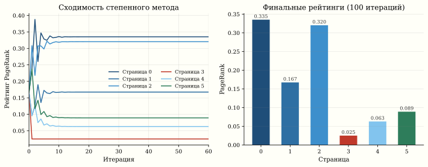
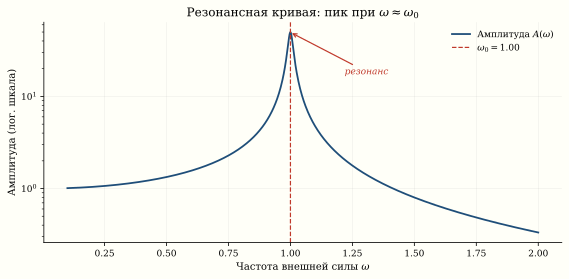
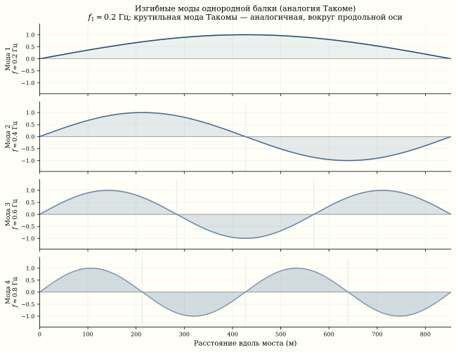

*Такомский мост разрушился не от силы ветра — от его частоты: 67 км/ч совпали с одним секретным числом матрицы жёсткости. В тот же год Google обнаружил, что порядок среди миллиардов страниц — это тоже одно число, первое собственное значение матрицы ссылок. В обоих случаях системой управляют не все элементы матрицы, а несколько её характеристических чисел — собственных значений.*

## Собственные значения: что это

Для квадратной матрицы $A \in \mathbb{R}^{n \times n}$
собственное значение $\lambda$ и собственный вектор $v \neq 0$ —
это пара, удовлетворяющая:

$$
A v = \lambda v.
$$

Матрица $A$ действует на $v$ как масштабирование: направление
сохраняется, меняется только длина (и, возможно, знак).

У матрицы $n \times n$ — ровно $n$ собственных значений
(с учётом кратности, в $\mathbb{C}$). Они образуют
**спектр** матрицы.

## История 1: PageRank

### Как Google нашёл порядок в Интернете

В 1998 году Ларри Пейдж и Сергей Брин^[Brin, Page.
[The Anatomy of a Large-Scale Hypertextual Web Search Engine](https://research.google/pubs/the-anatomy-of-a-large-scale-hypertextual-web-search-engine/), 1998.]
задали вопрос: как ранжировать миллиарды веб-страниц?

Интернет — ориентированный граф. Каждая страница $i$ ссылается
на несколько страниц $j$. Построим **матрицу переходов** $M$:

::: {.column-page}
$$
M_{ij} = \begin{cases}
1 / \text{deg}_{\text{out}}(j), & \text{если } j \to i, \\
0, & \text{иначе.}
\end{cases}
$$
:::

Столбец $j$ матрицы $M$ — распределение вероятностей:
если «случайный сёрфер» на странице $j$, он с равной
вероятностью переходит по любой из её ссылок.

### Стационарное распределение

Запустим случайного сёрфера и подождём долго. Его положение
сойдётся к **стационарному распределению** $\pi$:

$$
M \pi = \pi.
$$

Это уравнение означает: $\pi$ — **собственный вектор** $M$,
соответствующий собственному значению $\lambda = 1$.

По теореме Перрона–Фробениуса для стохастических матриц
$\lambda = 1$ — наибольшее собственное значение, и
соответствующий собственный вектор $\pi$ неотрицателен
и единственен (при условии связности и апериодичности графа).



::: {.column-margin}

::: {.callout-note title="Демпфирование"}
Чтобы гарантировать связность, Пейдж добавил «телепортацию»:
с вероятностью $\alpha = 0.85$ сёрфер идёт по ссылке,
с вероятностью $1 - \alpha$ — переходит на случайную страницу:

$$
M' = \alpha M + (1 - \alpha) \frac{1}{n} \mathbf{1}\mathbf{1}^T.
$$

Матрица $M'$ гарантированно имеет единственный стационарный
вектор.
:::

:::

::: {.callout-note collapse="true" title="Код: PageRank на маленьком вебе из 6 страниц"}
```{.python}
import numpy as np

# Маленький веб: 6 страниц
# 0 → {1, 2}, 1 → {2}, 2 → {0}, 3 → {2, 5}, 4 → {5}, 5 → {0, 4}
edges = {0: [1, 2], 1: [2], 2: [0], 3: [2, 5], 4: [5], 5: [0, 4]}
n = 6
M = np.zeros((n, n))
for j, targets in edges.items():
    for i in targets:
        M[i, j] = 1.0 / len(targets)

# Демпфирование
alpha = 0.85
M_damped = alpha * M + (1 - alpha) / n * np.ones((n, n))

# Метод степенной итерации
pi = np.ones(n) / n
for _ in range(100):
    pi = M_damped @ pi
    pi /= pi.sum()

print("PageRank:")
for i in range(n):
    print(f"  Страница {i}: {pi[i]:.4f}")

# Проверка: собственные значения
eigvals, eigvecs = np.linalg.eig(M_damped)
print(f"\nМакс. собственное значение: {eigvals[0].real:.6f}")
# Должно быть ≈ 1.0
```
:::

### Степенной метод

Google не вычисляет все собственные значения — на графе
из миллиардов узлов это невозможно. Вместо этого используется
**степенной метод**:

$$
\pi^{(k+1)} = M' \pi^{(k)}.
$$

Он сходится к главному собственному вектору со скоростью
$|\lambda_2 / \lambda_1|^k$, где $\lambda_2$ — второе по величине
собственное значение. При $\alpha = 0.85$ гарантировано
$|\lambda_2| \leq 0.85$, и для сходимости до 4 знаков
достаточно $\approx 50$–60 итераций: $\log(10^{-4}) / \log(0.85) \approx 57$.

## История 2: вибрации и шатающиеся мосты

### Собственные частоты

Натянутая струна, мембрана барабана, мост через реку —
все вибрирующие системы описываются дифференциальным уравнением:

$$
M \ddot{u} + K u = 0,
$$

где $M$ — матрица масс, $K$ — матрица жёсткости,
$u(t)$ — вектор смещений. Подстановка $u(t) = v \sin(\omega t)$
даёт обобщённую задачу на собственные значения:

$$
K v = \omega^2 M v.
$$

Собственные значения $\omega_i^2$ определяют **собственные
частоты** конструкции, а собственные векторы $v_i$ — формы
колебаний (моды).

### Такомский мост (1940)

7 ноября 1940 года мост Такома-Нэрроуз в штате Вашингтон
разрушился через четыре месяца после открытия. Ветер
со скоростью 67 км/ч вызвал крутильные колебания с нарастающей
амплитудой.

**Причина**: по популярному объяснению, частота вихревого обрыва ветра (vortex shedding)
совпала с одной из собственных частот моста — наступил
**резонанс**. Современный анализ (Billah & Scanlan, 1991) уточняет:
к моменту разрушения частоты уже не совпадали; механизм был
аэроупругой флаттерной неустойчивостью. Математика та же — собственные
частоты матрицы жёсткости, — но физика тоньше. Амплитуда колебаний росла до тех пор, пока
конструкция не разрушилась.

::: {.callout-important title="Резонанс"}
Если внешняя сила колеблется с частотой, близкой к собственной
частоте $\omega_i$ системы, амплитуда колебаний растёт.
В отсутствие демпфирования — до бесконечности. С демпфированием —
до $1/(2\zeta)$, где $\zeta$ — коэффициент демпфирования.
Мост Такома имел $\zeta \approx 0.002$ для крутильной моды.
:::





### Численная модель: мост как система масс на пружинах

::: {.callout-important title="Поиграть: резонанс моста" collapse="false"}
Представим мост цепочкой масс на пружинах. Её собственные частоты — это корни из собственных значений матрицы жёсткости. Теперь «раскачаем» мост внешней силой и плавно меняем её частоту: амплитуда взлетает к небесам ровно тогда, когда частота силы совпадает с собственной (красные пунктиры). Это и есть резонанс, разрушивший Такомский мост в 1940-м. Меняйте число масс — частот станет больше.
:::

::: {.callout-note collapse="true" title="Код: собственные частоты моста как цепочки масс"}
```{.python}
import numpy as np
import matplotlib.pyplot as plt

def bridge_eigenfrequencies(n_segments=20, L=853, EI=1e10,
                             m_per_m=5700):
    """
    Модель моста как балки Эйлера–Бернулли,
    дискретизованная конечными разностями.

    n_segments: число сегментов
    L: длина моста (м), Такома = 853 м
    EI: изгибная жёсткость (Н·м²)
    m_per_m: масса на погонный метр (кг/м)
    """
    n = n_segments
    h = L / n
    m = m_per_m * h  # масса одного сегмента

    # Матрица жёсткости для балки (4-я разность)
    K = np.zeros((n-1, n-1))
    for i in range(n-1):
        K[i, i] = 6
        if i > 0:
            K[i, i-1] = -4
            K[i-1, i] = -4
        if i > 1:
            K[i, i-2] = 1
            K[i-2, i] = 1
    K *= EI / h**4

    M_mat = m * np.eye(n-1)

    # Обобщённая задача: K v = ω² M v
    eigvals = np.linalg.eigvalsh(np.linalg.solve(M_mat, K))
    freqs_hz = np.sqrt(np.abs(eigvals)) / (2 * np.pi)
    freqs_hz.sort()

    return freqs_hz

freqs = bridge_eigenfrequencies()
print("Первые 5 собственных частот моста (Гц):")
for i, f in enumerate(freqs[:5]):
    print(f"  Мода {i+1}: {f:.4f} Гц  (период {1/f:.2f} с)")

# Реальный Такома: крутильная мода ≈ 0.2 Гц
```
:::

### Формы колебаний

::: {.callout-note collapse="true" title="Код: построение форм колебаний"}
```{.python}
import numpy as np
import matplotlib.pyplot as plt

n = 30
L = 853
h = L / n
x = np.linspace(0, L, n+1)

# Упрощённая модель: однородная струна (аналогия)
# Формы колебаний — синусы
fig, axes = plt.subplots(4, 1, figsize=(10, 8))
for k in range(4):
    mode = np.sin((k+1) * np.pi * x / L)
    axes[k].plot(x, mode, 'b-', lw=2)
    axes[k].fill_between(x, mode, alpha=0.15)
    axes[k].axhline(0, color='k', lw=0.5)
    axes[k].set_ylabel(f"Мода {k+1}")
    axes[k].set_xlim(0, L)
    axes[k].set_ylim(-1.5, 1.5)
axes[3].set_xlabel("Расстояние вдоль моста (м)")
axes[0].set_title("Формы колебаний (моды) моста")
plt.tight_layout()
```
:::

## Единая математика

| Задача | Матрица | Что значит $\lambda$ | Что значит $v$ |
|:--|:--|:--|:--|
| PageRank | Матрица переходов $M$ | $\lambda_1 = 1$ (стационарность) | Вектор рейтингов страниц |
| Мост | $M^{-1}K$ (жёсткость/масса) | $\omega^2$ (собственная частота) | Форма колебания (мода) |
| Кластеризация | Лапласиан графа $L$ | Малые $\lambda$ → кластеры | Координаты кластеров |
| PCA | Ковариационная матрица $\Sigma$ | Дисперсия компоненты | Главное направление |
| Квантовая механика | Гамильтониан $H$ | Энергия состояния | Волновая функция |

Во всех случаях структура одна: матрица кодирует систему,
собственные значения — её характеристические параметры,
собственные векторы — характеристические «формы».

**Единый закон:** собственное значение — это *резонансная частота* системы в широком смысле. PageRank ищет ту частоту, на которой граф «колеблется стационарно» ($\lambda_1 = 1$). Мост гибнет, когда ветер попадает в резонанс с одной из собственных частот матрицы жёсткости. Везде: система хранит в своих собственных значениях список «опасных» или «выделенных» частот — и природа, и алгоритм выбирают именно их.

## Второе собственное значение: скорость сходимости

::: {.callout-warning title="Осторожно: три разных λ₂"}
В каждом контексте ниже $\lambda_2$ — свой объект, аналогия лишь структурная. Не переносить выводы между контекстами.
:::

В PageRank $\lambda_1 = 1$ даёт стационарное распределение.
А $\lambda_2$ определяет **скорость сходимости** к нему:
чем меньше $|\lambda_2|$, тем быстрее степенной метод сходится.

В колебательной задаче второе собственное значение $\lambda_2 = \omega_2^2$ —
это **первый обертон**: вторая мода струны, что звучит на октаву выше
основного тона ($\lambda_1 = \omega_1^2$). Сам основной тон задаёт именно
$\lambda_1$ — наименьшее собственное значение, ту моду, которую малая сила
раскачивает легче всего.

В спектральной кластеризации $\lambda_2$ графового лапласиана —
**алгебраическая связность** (Fiedler value): она показывает,
насколько «тяжело» разрезать граф на две части. Малый $\lambda_2$ —
граф легко распадается.

## Численный эксперимент: резонанс

::: {.callout-note collapse="true" title="Код: резонансная кривая гармонического осциллятора"}
```{.python}
import numpy as np
import matplotlib.pyplot as plt

# Гармонический осциллятор с внешней силой
# m ẍ + c ẋ + k x = F₀ cos(ω_ext t)
m, c, k = 1.0, 0.02, 1.0  # слабое демпфирование
omega_0 = np.sqrt(k / m)   # собственная частота
print(f"Собственная частота: ω₀ = {omega_0:.3f}")

omega_ext_values = np.linspace(0.1, 2.0, 500)
F0 = 1.0

# Амплитуда установившихся колебаний
amplitudes = F0 / np.sqrt((k - m * omega_ext_values**2)**2
                           + (c * omega_ext_values)**2)

plt.figure(figsize=(10, 5))
plt.plot(omega_ext_values, amplitudes, 'b-', lw=2)
plt.axvline(omega_0, color='r', ls='--', label=f"ω₀ = {omega_0:.2f}")
plt.xlabel("Частота внешней силы ω")
plt.ylabel("Амплитуда")
plt.title("Резонансная кривая: пик при ω ≈ ω₀")
plt.legend()
plt.yscale('log')
plt.grid(True, alpha=0.3)
```
:::

## Современные мосты

После Такомы инженеры обязательно вычисляют собственные частоты
конструкции и проверяют их удалённость от частот ветровой нагрузки.
Метод конечных элементов (FEM) дискретизирует мост в матрицу
$K$ и $M$ размером в миллионы, а алгоритмы Ланцоша и Арнольди
эффективно находят несколько наименьших собственных значений.

Лондонский Millennium Bridge (2000) — другой пример: при открытии
тысячи пешеходов синхронизировали шаг, возбудив боковую моду
с $f \approx 0.5$ Гц. Мост закрыли на 2 года для установки
демпферов.

## Связи

- **PageRank**: подробное изложение теоремы Перрона–Фробениуса и алгоритма ранжирования
- **Цепи Маркова**: стационарное распределение как собственный вектор с $\lambda = 1$
- **Спектральная кластеризация**: графовый лапласиан и Fiedler value
- **PCA**: собственные значения ковариационной матрицы как дисперсии главных компонент
