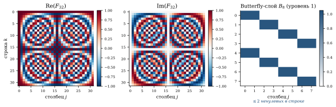
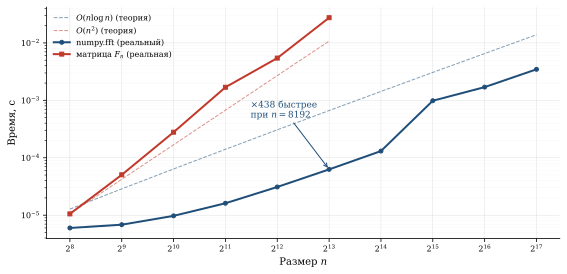
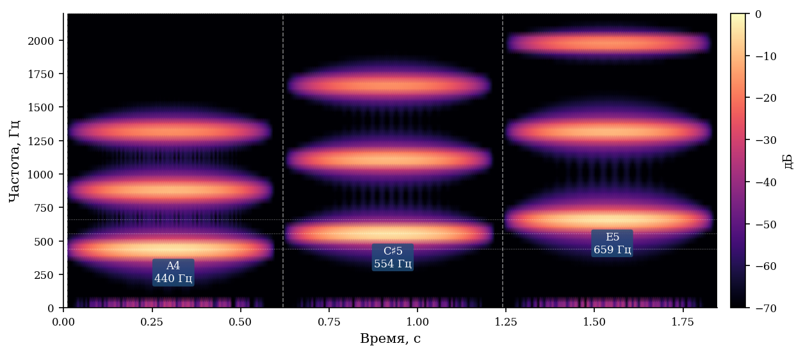

*За 4 секунды Shazam перебирает 50 миллионов треков и находит нужный — без перебора. Секрет: одно математическое наблюдение о матрице Фурье превращает $O(n^2)$ операций в $O(n \log n)$. Дискретное преобразование Фурье — это умножение вектора на матрицу $F_n$, элементы которой — корни из единицы. Быстрое преобразование Фурье (БПФ, Кули–Тьюки, 1965) — это факторизация $F_n$ в произведение $\log_2 n$ разреженных матриц. Одно алгебраическое тождество — и задача, непосильная для матрицы, решается за миллисекунды.*

## ДПФ как матричное умножение

Дискретное преобразование Фурье вектора $x = (x_0, x_1, \ldots, x_{n-1})^T$:

::: {.column-page}
$$
X_k = \sum_{j=0}^{n-1} x_j \cdot \omega_n^{jk}, \quad k = 0, 1, \ldots, n-1,
$$
:::

где $\omega_n = e^{-2\pi i/n}$ — примитивный корень $n$-й степени из единицы.

В матричной форме это записывается как $X = F_n \cdot x$, где матрица Фурье:

::: {.column-page}
$$
F_n = \begin{pmatrix}
1 & 1 & 1 & \cdots & 1 \\
1 & \omega & \omega^2 & \cdots & \omega^{n-1} \\
1 & \omega^2 & \omega^4 & \cdots & \omega^{2(n-1)} \\
\vdots & & & \ddots & \vdots \\
1 & \omega^{n-1} & \omega^{2(n-1)} & \cdots & \omega^{(n-1)^2}
\end{pmatrix}
$$
:::

Элемент $(k, j)$ матрицы $F_n$ — это $\omega_n^{jk}$, корень из единицы.

::: {.column-margin}

::: {.callout-note title="Свойства матрицы Фурье"}
- $F_n$ — **унитарная** (с точностью до нормировки): $F_n^* F_n = nI$
- Строки $F_n$ — ортогональные базисные вектора «частотного» пространства
- Обратное преобразование: $x = \frac{1}{n} F_n^* X$ (сопряжённая матрица)
- Все элементы $F_n$ лежат на единичной окружности в $\mathbb{C}$
:::

:::



### Пример: $n = 4$

Для $n = 4$ имеем $\omega_4 = e^{-2\pi i/4} = -i$:

::: {.column-page}
$$
F_4 = \begin{pmatrix}
1 & 1 & 1 & 1 \\
1 & -i & -1 & i \\
1 & -1 & 1 & -1 \\
1 & i & -1 & -i
\end{pmatrix}
$$
:::

Прямое умножение $F_4 \cdot x$ — это $4^2 = 16$ умножений.

```{.python}
import numpy as np

n = 4
omega = np.exp(-2j * np.pi / n)

# Матрица Фурье
F4 = np.array([[omega**(j*k) for j in range(n)] for k in range(n)])
print("F_4 =")
print(np.round(F4, 3))
# F_4 =
# [[ 1.+0.j  1.+0.j  1.+0.j  1.+0.j]
#  [ 1.+0.j  0.-1.j -1.+0.j  0.+1.j]
#  [ 1.+0.j -1.+0.j  1.+0.j -1.+0.j]
#  [ 1.+0.j  0.+1.j -1.+0.j  0.-1.j]]

x = np.array([1, 2, 3, 4])
X_matrix = F4 @ x
X_fft    = np.fft.fft(x)
print(f"F4 @ x  = {np.round(X_matrix, 3)}")
print(f"np.fft  = {np.round(X_fft, 3)}")
# Совпадают!
```

## Идея БПФ: факторизация матрицы

Гениальность алгоритма Кули–Тьюки (1965)^[Cooley, Tukey.
[An Algorithm for the Machine Calculation of Complex Fourier Series](https://doi.org/10.2307/2003354), Mathematics of Computation, 1965.]:
матрицу $F_n$ (при $n = 2^m$) можно разложить в произведение
$m = \log_2 n$ **разреженных** матриц, каждая с $O(n)$
ненулевыми элементами.

### Рекурсивное разделение

Разобьём $x$ на чётные и нечётные компоненты:

::: {.column-page}
$$
X_k = \underbrace{\sum_{j=0}^{n/2-1} x_{2j}\, \omega_n^{2jk}}_{\text{ДПФ чётных}} + \omega_n^k \underbrace{\sum_{j=0}^{n/2-1} x_{2j+1}\, \omega_n^{2jk}}_{\text{ДПФ нечётных}}
$$
:::

Здесь — главный трюк, до неприличия простой: $\omega_n^2 = \omega_{n/2}$. Одно равенство — и обе суммы оказываются ДПФ половинного размера. Применяем рекурсивно $\log_2 n$ раз — и $n^2$ превращается в $n \log n$.

Обозначим ДПФ чётных и нечётных компонент $E_k$ и $O_k$:

$$
X_k = E_{k \bmod n/2} + \omega_n^k \cdot O_{k \bmod n/2}
$$

Это «бабочка» (butterfly operation): каждый выход зависит
от двух входов, и на каждом уровне рекурсии — $n/2$ бабочек.

### Матричная факторизация

Для $n = 8$ матрица $F_8$ раскладывается как:

::: {.column-page}
$$
F_8 = P_8 \cdot \underbrace{(I_4 \oplus D_4) \cdot (F_4 \otimes I_2)}_{\text{уровень 2}} \cdot \underbrace{(I_2 \oplus D_2) \cdot (F_2 \otimes I_4)}_{\text{уровень 1}} \cdot \ldots
$$
:::

где $D_k = \text{diag}(1, \omega, \omega^2, \ldots)$ — диагональ
twiddle-факторов, $P_8$ — перестановка (bit-reversal),
$\otimes$ — произведение Кронекера.

Каждый множитель — разреженная матрица с $O(n)$ ненулевых
элементов. Всего $\log_2 n$ таких множителей, итого
$O(n \log n)$ операций вместо $O(n^2)$.

::: {.callout-note collapse="true" title="Код: БПФ против наивного умножения на матрицу"}
```{.python}
import numpy as np
import time

for n in [2**10, 2**15, 2**20, 2**25]:
    x = np.random.randn(n) + 1j * np.random.randn(n)

    t0 = time.time()
    X_fft = np.fft.fft(x)
    t_fft = time.time() - t0

    if n <= 2**15:
        F = np.array([[np.exp(-2j*np.pi*j*k/n) for j in range(n)]
                       for k in range(n)])
        t0 = time.time()
        X_mat = F @ x
        t_mat = time.time() - t0
        ratio = t_mat / t_fft
    else:
        t_mat = float('inf')
        ratio = float('inf')

    print(f"n={n:>10d}: FFT={t_fft:.4f}s, матрица={t_mat:.4f}s, "
          f"ускорение={ratio:.0f}x")
# n=      1024: FFT=0.0001s, матрица=0.0312s,  ускорение=312x
# n=     32768: FFT=0.0010s, матрица=30.12s,    ускорение=30120x
# n=   1048576: FFT=0.0320s, матрица=∞           (не дождёмся)
```
:::

Возьмите два чистых тона, сложите их и посмотрите, как ДПФ мгновенно разбирает сумму обратно на два пика — потяните частоты и проследите, на какие строки матрицы $F_n$ они «садятся».

::: {.column-page}
```{=html}
<div data-sigma-widget="fft-spectrum"></div>
```
:::



## Спектрограмма: частота × время

Чистое ДПФ даёт спектр всего сигнала, но не говорит,
**когда** прозвучала каждая нота. Решение — оконное ДПФ
(Short-Time Fourier Transform, STFT): разбиваем сигнал
на перекрывающиеся фрагменты и считаем ДПФ каждого:

::: {.column-page}
$$
S(t, f) = \left|\sum_{j} x(j) \cdot w(j - t) \cdot e^{-2\pi i f j / n}\right|^2,
$$
:::

где $w$ — оконная функция (Hann, Hamming). Результат —
двумерная карта $S(t, f)$, называемая **спектрограммой**.



## Как работает Shazam

Wang^[Wang, Avery Li-Chun. [An Industrial-Strength Audio Search Algorithm](https://www.ee.columbia.edu/~dpwe/papers/Wang03-shazam.pdf), ISMIR 2003.] описал алгоритм Shazam в 2003 году:

**1. Спектрограмма.** Записанный фрагмент (4—10 секунд)
преобразуется в спектрограмму через STFT.

**2. Выделение пиков.** На спектрограмме находятся локальные
максимумы — точки $(t_i, f_i)$ с наибольшей энергией
в окрестности. Это **конструктивные точки** (constellation
points).

**3. Хеширование пар.** Пары ближайших пиков образуют
«отпечатки» (fingerprints):

::: {.column-page}
$$
\text{hash} = \text{H}(f_1, f_2, \Delta t), \quad \Delta t = t_2 - t_1.
$$
:::

Каждый хеш — 32-битное число. Один 4-секундный фрагмент
порождает сотни хешей.

**4. Поиск.** База данных содержит хеши 50+ миллионов треков.
Совпавшие хеши дают гипотезы; если достаточно много хешей
совпало с одной и той же временной привязкой — трек найден.

::: {.callout-note collapse="true" title="Код: построение отпечатка (constellation hashing)"}
```{.python}
import numpy as np
from scipy.signal import find_peaks
from scipy.ndimage import maximum_filter

def find_constellation_points(Sxx, freq_bins, time_bins,
                               neighborhood_size=20, threshold_db=20):
    """Находим пики на спектрограмме (constellation points)."""
    Sxx_db = 10 * np.log10(Sxx + 1e-10)

    # Локальные максимумы через maximum_filter
    local_max = maximum_filter(Sxx_db, size=neighborhood_size)
    peaks = (Sxx_db == local_max) & (Sxx_db > Sxx_db.max() - threshold_db)

    freq_idx, time_idx = np.where(peaks)
    return list(zip(time_bins[time_idx], freq_bins[freq_idx]))

def create_fingerprints(points, fan_out=10, dt_max=200):
    """Создаём хеши из пар пиков."""
    fingerprints = []
    points.sort()  # сортировка по времени
    for i, (t1, f1) in enumerate(points):
        for j in range(i + 1, min(i + fan_out + 1, len(points))):
            t2, f2 = points[j]
            dt = t2 - t1
            if 0 < dt <= dt_max:
                h = hash((int(f1), int(f2), int(dt)))
                fingerprints.append((h, t1))
    return fingerprints
```
:::

::: {.callout-important title="Почему это быстро"}
Поиск по хеш-таблице — $O(1)$ на каждый хеш. Один 4-секундный фрагмент порождает сотни хешей; для каждого — мгновенный запрос в таблицу. Победитель определяется голосованием: если сотни хешей указывают на один трек с одинаковым временным сдвигом — это он. База в 50 миллионов треков при этом не «перебирается» — она адресуется напрямую.
:::

## Матрица Фурье и физика

Почему именно ДПФ? Потому что **синусоиды — собственные функции
линейных стационарных систем**. Если система не меняется
во времени и линейна (акустика, электрические цепи, оптика),
то синусоида на входе даёт синусоиду на выходе, только с другой
амплитудой и фазой. Это делает разложение по синусоидам
**естественным базисом** для анализа любого сигнала.

Матрица $F_n$ — дискретный аналог разложения по $e^{i\omega t}$.

## Где ещё работает та же матрица

| Область | Что делает ДПФ |
|:--|:--|
| **JPEG** | DCT (= вещественная версия ДПФ) блока 8×8 пикселей |
| **MP3** | Модифицированный DCT на 576 аудиосэмплах |
| **Wi-Fi (OFDM)** | Мультиплексирование подканалов через обратное ДПФ |
| **MRI** | Восстановление изображения из k-пространства = обратное 2D-ДПФ |
| **Свёртка** | $x * h = F^{-1}(F(x) \cdot F(h))$ — $O(n \log n)$ вместо $O(n^2)$ |
| **Умножение полиномов** | Те же свёртки; внутри `numpy.polymul` |
| **Быстрое умножение** | Алгоритм Шёнхаге–Штрассена для $n$-значных чисел |

## Резюме

БПФ — не просто алгоритм, а теорема о структуре матрицы $F_n$: в ней спрятано $\log_2 n$ разреженных слоёв, и это следует из одного равенства $\omega_n^2 = \omega_{n/2}$. Именно поэтому умножение на плотную матрицу стоит $O(n \log n)$, а не $O(n^2)$ — и именно поэтому Shazam успевает за 4 секунды.

Пики, которые вы видели в виджете — это конструктивные точки спектрограммы: именно они хешируются и сравниваются с базой треков. Идея разреженной факторизации плотной матрицы оказалась универсальной: её используют вейвлеты, JPEG, OFDM в Wi-Fi и — в другой форме — линейные трансформеры с ядровым приближением внимания.
