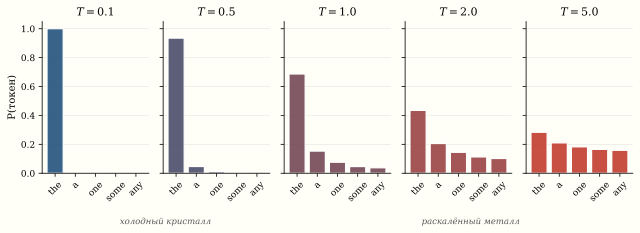

*Задача коммивояжёра для 100 городов имеет ${\sim}10^{156}$ возможных маршрутов. Перебирать все — дольше, чем возраст Вселенной. Но природа решает подобные задачи каждый день: муравьи находят кратчайший путь к пище, металл при охлаждении принимает кристаллическую структуру с минимальной энергией, а стая птиц координируется без лидера. Три метаэвристики — генетический алгоритм, роевой интеллект и имитация отжига — переносят эти идеи в код. А та же «температура» из отжига неожиданно появляется при генерации текста в ChatGPT.*

## Задача коммивояжёра (TSP) как полигон

$n$ городов, матрица расстояний $D_{ij}$. Найти перестановку
$\pi$, минимизирующую суммарную длину тура:

$$
L(\pi) = \sum_{i=1}^{n-1} D_{\pi(i), \pi(i+1)} + D_{\pi(n), \pi(1)}.
$$

TSP — NP-трудна. Перебрать все маршруты невозможно ни при каком разумном $n$: уже при $n \gtrsim 25$ перебор займёт дольше возраста Вселенной (при скорости $10^9$ маршрутов/с). Точные алгоритмы (Concorde, LKH) справляются с тысячами городов, но для $n \sim 10^4$ требуют часов. Метаэвристики находят решения, близкие к оптимуму, за секунды.

## Генетический алгоритм (GA)

Holland (1975)^[Holland, J.H. *Adaptation in Natural and Artificial Systems*. University of Michigan Press, 1975.] — имитация эволюции:

**1. Популяция.** $P$ случайных туров (перестановок).

**2. Fitness.** $f(\pi) = 1 / L(\pi)$ — чем короче тур, тем выше приспособленность.

**3. Селекция.** Турнирный отбор: из случайной пары выбираем лучшего.

**4. Кроссовер** (Order Crossover, OX). Берём подстроку
из родителя A, оставшиеся позиции заполняем из родителя B
в порядке появления.

**5. Мутация.** С малой вероятностью $p_m \approx 0{,}01$ меняем местами
два случайных города.

**6. Следующее поколение.** Лучшие потомки заменяют худших.

::: {.callout-note collapse="true" title="Код: генетический алгоритм для TSP"}
```{.python}
import numpy as np

def solve_tsp_ga(D, pop_size=200, generations=500, mutation_rate=0.02):
    n = D.shape[0]

    def tour_length(tour):
        return sum(D[tour[i], tour[(i+1) % n]] for i in range(n))

    # Инициализация
    population = [np.random.permutation(n) for _ in range(pop_size)]
    best_ever = min(population, key=tour_length)
    best_len = tour_length(best_ever)
    history = []

    for gen in range(generations):
        fitness = np.array([1.0 / tour_length(p) for p in population])

        new_pop = []
        for _ in range(pop_size):
            # Турнирная селекция
            i, j = np.random.choice(pop_size, 2, replace=False)
            parent_a = population[i] if fitness[i] > fitness[j] else population[j]
            i, j = np.random.choice(pop_size, 2, replace=False)
            parent_b = population[i] if fitness[i] > fitness[j] else population[j]

            # Order Crossover (OX)
            child = np.full(n, -1)
            start, end = sorted(np.random.choice(n, 2, replace=False))
            child[start:end] = parent_a[start:end]
            fill = [g for g in parent_b if g not in child[start:end]]
            idx = 0
            for k in range(n):
                if child[k] == -1:
                    child[k] = fill[idx]
                    idx += 1

            # Мутация (swap)
            if np.random.rand() < mutation_rate:
                i, j = np.random.choice(n, 2, replace=False)
                child[i], child[j] = child[j], child[i]

            new_pop.append(child)

        population = new_pop
        current_best = min(population, key=tour_length)
        current_len = tour_length(current_best)
        if current_len < best_len:
            best_ever = current_best.copy()
            best_len = current_len
        history.append(best_len)

    return best_ever, best_len, history

# Пример: 50 случайных городов
n_cities = 50
np.random.seed(42)
coords = np.random.rand(n_cities, 2) * 100
D = np.sqrt(((coords[:, None] - coords[None, :]) ** 2).sum(axis=2))

best_tour, best_length, history = solve_tsp_ga(D)
print(f"GA: лучший тур = {best_length:.2f}")
```
:::

## Particle Swarm Optimization (PSO)

Kennedy и Eberhart (1995)^[Kennedy, Eberhart.
[Particle Swarm Optimization](https://doi.org/10.1109/ICNN.1995.488968), IEEE ICNN, 1995.]
— вдохновлены стаей птиц и косяком рыб.

### Алгоритм

Каждая «частица» $i$ имеет:
- позицию $x_i \in \mathbb{R}^d$
- скорость $v_i \in \mathbb{R}^d$
- лучшую личную позицию $p_i$ (personal best)
- лучшую позицию всей стаи $g$ (global best)

На каждом шаге:

::: {.column-page}
$$
v_i \leftarrow \underbrace{w \cdot v_i}_{\text{инерция}}
+ \underbrace{c_1 r_1 (p_i - x_i)}_{\text{когнитивная}}
+ \underbrace{c_2 r_2 (g - x_i)}_{\text{социальная}},
$$
:::

$$
x_i \leftarrow x_i + v_i,
$$

где $w \approx 0{,}7$ — коэффициент инерции,
$c_1, c_2 \approx 1{,}5$ — коэффициенты «доверия» к себе и стае,
$r_1, r_2 \sim U(0,1)$ — случайные числа.

::: {.callout-note title="Три силы PSO"}
1. **Инерция** ($w v_i$): частица продолжает движение по инерции — exploration.
2. **Когнитивная** ($c_1 r_1 (p_i - x_i)$): частица помнит своё лучшее место.
3. **Социальная** ($c_2 r_2 (g - x_i)$): частица стремится к лучшему месту стаи.

Баланс между exploration (инерция) и exploitation (социальная)
определяет эффективность PSO. Слишком большая инерция —
стая разлетается. Слишком сильная социальная сила — все
слетаются к локальному минимуму.
:::

::: {.callout-note collapse="true" title="Код: роевой алгоритм PSO"}
```{.python}
import numpy as np
import matplotlib.pyplot as plt

def pso(f, bounds, n_particles=30, max_iter=200,
        w=0.7, c1=1.5, c2=1.5):
    """Particle Swarm Optimization."""
    d = len(bounds)
    lo = np.array([b[0] for b in bounds])
    hi = np.array([b[1] for b in bounds])

    # Инициализация
    x = np.random.uniform(lo, hi, (n_particles, d))
    v = np.random.uniform(-(hi-lo)*0.1, (hi-lo)*0.1, (n_particles, d))
    p_best = x.copy()
    p_best_val = np.array([f(xi) for xi in x])
    g_best = p_best[np.argmin(p_best_val)].copy()
    g_best_val = p_best_val.min()
    history = [g_best_val]

    for t in range(max_iter):
        r1 = np.random.rand(n_particles, d)
        r2 = np.random.rand(n_particles, d)

        v = w * v + c1 * r1 * (p_best - x) + c2 * r2 * (g_best - x)
        x = x + v
        x = np.clip(x, lo, hi)

        vals = np.array([f(xi) for xi in x])
        improved = vals < p_best_val
        p_best[improved] = x[improved]
        p_best_val[improved] = vals[improved]

        if vals.min() < g_best_val:
            g_best = x[np.argmin(vals)].copy()
            g_best_val = vals.min()

        history.append(g_best_val)

    return g_best, g_best_val, history

# Функция Растригина: много локальных минимумов
def rastrigin(x):
    return 10 * len(x) + sum(xi**2 - 10 * np.cos(2 * np.pi * xi)
                              for xi in x)

best, best_val, hist = pso(rastrigin, [(-5.12, 5.12)] * 10,
                            n_particles=50, max_iter=300)
print(f"PSO на Rastrigin (d=10): f* = {best_val:.6f}")
# Глобальный минимум = 0 при x = 0
```
:::

### Визуализация роя


## Имитация отжига (SA) и температура

Kirkpatrick et al. (1983)^[Kirkpatrick, Gelatt, Vecchi.
[Optimization by Simulated Annealing](https://doi.org/10.1126/science.220.4598.671), Science, 1983.] — прямая аналогия с физикой:

При высокой температуре атомы металла свободно перемещаются
(жидкость). При медленном охлаждении они упорядочиваются
в кристалл — состояние с минимальной энергией.

### Критерий Метрополиса

На каждом шаге предлагаем случайное изменение $\Delta E = f(x') - f(x)$:

::: {.column-page}
$$
P(\text{принять}) = \begin{cases}
1, & \text{если } \Delta E < 0 \text{ (улучшение)}, \\
\exp(-\Delta E / T), & \text{если } \Delta E \geq 0 \text{ (ухудшение)}.
\end{cases}
$$
:::

При высоком $T$ принимаем почти любое изменение (exploration).
При низком $T$ — только улучшения (exploitation).

### Расписание охлаждения

$$
T(t) = T_0 \cdot \alpha^t, \quad \alpha \in [0{,}95, 0{,}999].
$$

## Температура в LLM: та же формула

Это не случайное совпадение формул. В 1986 году Хинтон и соавторы (Boltzmann machines) напрямую позаимствовали критерий Метрополиса для обучения нейронных сетей: вероятность активации нейрона определялась той же формулой $\sigma(\Delta E / T)$. Оттуда температурный параметр перешёл в softmax-сэмплинг языковых моделей.

При генерации текста модель вычисляет логиты
$z_i$ для каждого токена $i$ в словаре и применяет softmax:

$$
P(i) = \frac{\exp(z_i / T)}{\sum_j \exp(z_j / T)}.
$$

Параметр $T$ — **temperature** — управляет «случайностью» генерации:

| $T$ | Поведение | Аналогия |
|:--|:--|:--|
| $T \to 0$ | Жадный выбор (argmax) | Замороженный кристалл |
| $T = 1$ | Стандартное распределение | Комнатная температура |
| $T > 1$ | Более равномерное, «креативное» | Нагретый металл |



::: {.callout-important title="Единая идея: exploration vs exploitation"}
Во всех трёх методах ключевой параметр управляет балансом
между **исследованием** (exploration) и **эксплуатацией**
(exploitation):

- **GA**: вероятность мутации $p_m$
- **PSO**: инерция $w$ vs социальная сила $c_2$
- **SA/LLM**: температура $T$

Все три задачи — TSP, минимизация Растригина, генерация текста —
сводятся к одной: найти хорошее решение в огромном дискретном
или непрерывном пространстве, избегая ловушек локальных оптимумов.
:::

Покрутите температуру и посмотрите, как отжиг прямо на глазах перекраивает маршрут: при жаре он смело принимает ухудшения и выпрыгивает из ловушек, а остывая — застывает в найденном минимуме. Кликайте по полю, чтобы подбросить новый город.

::: {.column-page}
```{=html}
<div data-sigma-widget="annealing-tsp"></div>
```
:::

## Сравнение на TSP

::: {.callout-note collapse="true" title="Код: имитация отжига для TSP"}
```{.python}
# SA для TSP
def solve_tsp_sa(D, T0=100, alpha=0.9995, max_iter=100000):
    n = D.shape[0]
    tour = np.random.permutation(n)

    def length(t):
        return sum(D[t[i], t[(i+1)%n]] for i in range(n))

    current_len = length(tour)
    best_tour = tour.copy()
    best_len = current_len
    T = T0

    for step in range(max_iter):
        # Случайная перестановка двух городов
        i, j = sorted(np.random.choice(n, 2, replace=False))
        new_tour = tour.copy()
        new_tour[i:j+1] = new_tour[i:j+1][::-1]  # 2-opt move
        new_len = length(new_tour)

        dE = new_len - current_len
        if dE < 0 or np.random.rand() < np.exp(-dE / T):
            tour = new_tour
            current_len = new_len
            if current_len < best_len:
                best_tour = tour.copy()
                best_len = current_len

        T *= alpha

    return best_tour, best_len

best_sa, len_sa = solve_tsp_sa(D)
print(f"SA: лучший тур = {len_sa:.2f}")
```
:::

## Резюме

| Метод | Вдохновение | Ключевой параметр | Сильная сторона |
|:--|:--|:--|:--|
| GA | Эволюция | Мутация, кроссовер | Комбинаторика, гибкость представления |
| PSO | Стая птиц | Инерция, социальная сила | Непрерывные задачи, простота |
| SA | Кристаллизация | Температура $T$ | Богатая теория сходимости (гарантия — при логарифм. охлаждении) |
| LLM sampling | SA / Больцман (1986) | Температура $T$ | Управление случайностью генерации, баланс точность/разнообразие |

Все четыре — варианты стохастического поиска, и все управляют
одним и тем же dial: случайность → детерминизм.
