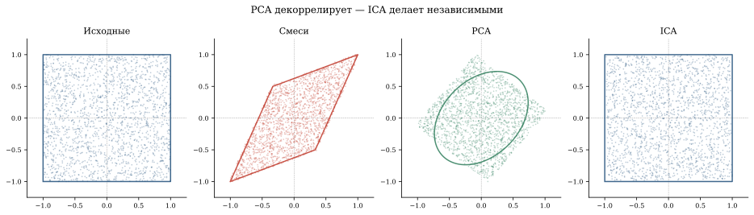

*Представьте комнату с тремя людьми и тремя микрофонами. Каждый микрофон записывает смесь всех трёх голосов. Задача — восстановить отдельные голоса, не зная ни расположения микрофонов, ни характеристик голосов. Это **задача коктейльной вечеринки** (cocktail party problem), и её решает метод независимых компонент (ICA) — одна из самых элегантных идей на стыке линейной алгебры и статистики. Удивительно: для этого не нужно знать ни матрицу смешивания $A$, ни форму сигналов — достаточно того, что они не гауссовы.*


## Постановка задачи

Пусть $s(t) = (s_1(t), \ldots, s_n(t))^T$ — вектор из $n$
исходных сигналов (голоса, музыка, шум). Микрофоны записывают
линейные смеси:

$$
x(t) = A \cdot s(t),
$$

где $A \in \mathbb{R}^{n \times n}$ — неизвестная матрица
смешивания. Мы наблюдаем только $x(t)$. Нужно найти
матрицу $W \approx A^{-1}$, чтобы восстановить:

$$
\hat{s}(t) = W \cdot x(t).
$$

::: {.callout-important title="Чем ICA отличается от PCA"}
**PCA** ищет ортогональные направления максимальной дисперсии
и делает компоненты **некоррелированными** ($\text{Cov}(y_i, y_j) = 0$).
Но некоррелированность ≠ независимость.

**ICA** ищет направления, делающие компоненты **статистически
независимыми** ($P(y_i, y_j) = P(y_i) P(y_j)$). Это гораздо
более сильное условие, и именно оно нужно для разделения
сигналов.
:::

## Почему PCA не справляется

Рассмотрим два независимых равномерных сигнала $s_1, s_2 \sim U[-1, 1]$.
Их совместное распределение — квадрат. После линейного смешивания
$x = As$ квадрат превращается в параллелограмм.

PCA находит оси максимальной дисперсии — это главные оси
эллипса, вписанного в параллелограмм. Но стороны параллелограмма
(= направления исходных сигналов) в общем случае **не совпадают**
с осями эллипса.

ICA ищет именно стороны параллелограмма — направления,
при проецировании на которые распределения **максимально
негауссовы**.



## Ключевая идея: негауссовость

Центральная предельная теорема говорит: сумма независимых
случайных величин стремится к гауссову распределению.
Значит, **смесь** сигналов более гауссова, чем каждый
сигнал по отдельности.

Если мы найдём линейные комбинации $w^T x$, которые
**максимально далеки от гауссовости**, — это и будут
исходные компоненты. Это эквивалентно минимизации
взаимной информации между компонентами (см. раздел «[Связь с информационной теорией](#связь-с-информационной-теорией)» ниже).

::: {.column-margin}

::: {.callout-tip title="Закон ICA"}
**ЦПТ — ваш ориентир.** Смесь сигналов гауссовее каждого компонента. Ищите самые негауссовые проекции — там спрятаны источники.
:::

:::

Меры негауссовости:

- **Куртозис** (эксцесс): для центрированной величины ($\mathbb{E}[y] = 0$):
  $$\kappa_4 = \mathbb{E}[y^4] - 3(\mathbb{E}[y^2])^2.$$
  Для гауссова $\kappa_4 = 0$. Для равномерного $\kappa_4 < 0$ (плосковершинное).
  Для лапласова $\kappa_4 > 0$ (острый пик).

- **Негэнтропия**: $J(y) = H(y_{\text{gauss}}) - H(y) \geq 0$,
  где $y_{\text{gauss}}$ — гауссова случайная величина с такой же
  дисперсией. Негэнтропия = 0 только для гауссовой.

### Почему гауссов сигнал — слепое пятно ICA

Если один из исходных сигналов $s_i$ — гауссов, ICA
**не может** его отделить. Это фундаментальное ограничение:
гауссово распределение инвариантно относительно ортогональных
поворотов, и любой поворот «выглядит одинаково».

::: {.column-margin}

::: {.callout-note title="Условия работоспособности ICA"}
1. Не более одного гауссова сигнала среди компонент
2. Число наблюдений (микрофонов) ≥ числа источников
3. Данные порождены независимыми источниками (предположение модели; нарушение ведёт к смысловым артефактам, не к ошибке алгоритма)
4. Матрица смешивания $A$ обратима
5. ICA не определяет порядок компонент и их знак — это нормально (восстановленный сигнал 1 может соответствовать источнику 3)
:::

:::

## Алгоритм FastICA

Hyvärinen^[Hyvärinen, Oja. [Independent Component Analysis: Algorithms and Applications](https://doi.org/10.1016/S0893-6080(00)00026-5), Neural Networks, 2000.] предложил
эффективный итеративный алгоритм:

**Шаг 0.** Вычесть среднее и уравнять разброс по всем направлениям (это делает PCA):
$$
z = \Lambda^{-1/2} U^T (x - \bar{x}),
$$
где $U\Lambda U^T$ — собственное разложение ковариационной матрицы.
После этого ковариационная матрица становится единичной: $\text{Cov}(z) = I$ — данные
одинаково «раздуты» во все стороны, и дальше ICA ищет уже не масштаб, а форму распределения.

**Шаг 1.** Инициализация случайного вектора $w$ единичной нормы.

**Шаг 2.** Итерация с фиксированной точкой:

::: {.column-page}
$$
w \leftarrow \mathbb{E}[z \cdot g(w^T z)] - \mathbb{E}[g'(w^T z)] \cdot w,
$$
:::

где $g(u) = \tanh(u)$ — нелинейность (приближение негэнтропии).

**Шаг 3.** Нормализация: $w \leftarrow w / \|w\|$.

**Шаг 4.** Повторять шаги 2—3 до сходимости.

Для нескольких компонент добавляется ортогонализация
Грама–Шмидта между найденными направлениями.

```{.python}
import numpy as np

def fastica(X, n_components, max_iter=200, tol=1e-6):
    """Минимальная реализация FastICA."""
    n, m = X.shape  # n — число каналов, m — число отсчётов

    # Центрирование
    X = X - X.mean(axis=1, keepdims=True)

    # Уравниваем разброс по всем направлениям
    cov = np.cov(X)
    eigvals, eigvecs = np.linalg.eigh(cov)
    D = np.diag(1.0 / np.sqrt(eigvals + 1e-10))
    Z = D @ eigvecs.T @ X  # разброс по всем осям стал одинаковым

    W = np.zeros((n_components, n))
    for p in range(n_components):
        w = np.random.randn(n)
        w /= np.linalg.norm(w)

        for _ in range(max_iter):
            # g(u) = tanh(u), g'(u) = 1 - tanh(u)^2
            proj = w @ Z
            g = np.tanh(proj)
            gp = 1 - g**2

            w_new = (Z * g).mean(axis=1) - gp.mean() * w
            # Ортогонализация к уже найденным
            for j in range(p):
                w_new -= (w_new @ W[j]) * W[j]
            w_new /= np.linalg.norm(w_new)

            if abs(abs(w_new @ w) - 1) < tol:
                break
            w = w_new

        W[p] = w

    S = W @ Z  # восстановленные компоненты
    return S, W
```

## Демо: разделение звуков

Возьмитесь за стрелки и сами смешайте источники: тяните столбцы матрицы $A$ — квадрат на глазах перекашивается в параллелограмм, а оси PCA и ICA расходятся ровно так, как описано выше.

::: {.column-page}
```{=html}
<div data-sigma-widget="ica-cocktail"></div>
```
:::

```{.python}
import numpy as np
from sklearn.decomposition import FastICA
import matplotlib.pyplot as plt

np.random.seed(0)
n_samples = 2000
t = np.linspace(0, 8, n_samples)

# Три независимых источника
s1 = np.sin(2 * t)                           # синусоида
s2 = np.sign(np.sin(3 * t))                  # прямоугольная волна
s3 = (t % 1.5) / 1.5 - 0.5                   # пилообразная волна

S = np.c_[s1, s2, s3].T  # (3, n_samples)

# Матрица смешивания
A = np.array([[1.0, 0.5, 0.2],
              [0.3, 1.0, 0.7],
              [0.6, 0.4, 1.0]])
X = A @ S  # наблюдаемые смеси

# Восстановление через FastICA
ica = FastICA(n_components=3, random_state=42)
S_hat = ica.fit_transform(X.T).T

fig, axes = plt.subplots(3, 3, figsize=(14, 8), sharex=True)
titles = [["Источник 1", "Источник 2", "Источник 3"],
          ["Смесь 1", "Смесь 2", "Смесь 3"],
          ["Восстановленный 1", "Восстановленный 2", "Восстановленный 3"]]
data = [S, X, S_hat]
for row in range(3):
    for col in range(3):
        axes[row, col].plot(t, data[row][col], lw=0.8)
        axes[row, col].set_title(titles[row][col])
plt.tight_layout()
```

## Применения ICA

| Область | Задача | Что разделяем |
|:--|:--|:--|
| **Нейронауки** | Очистка ЭЭГ | Мозговая активность от моргания глаз |
| **fMRI** | Spatial ICA | Независимые нейронные сети мозга |
| **Финансы** | Выделение факторов | Независимые рыночные драйверы |
| **Телеком** | MIMO | Сигналы от разных антенн |
| **Астрономия** | Выделение CMB из смеси с галактической пылью | Реликтовое излучение и галактическая пыль |

### Пример: очистка ЭЭГ

Электроэнцефалограмма — сигнал с 64 электродов на голове.
Помимо мозговой активности, электроды ловят моргание (EOG),
сердцебиение (ECG), мышечные артефакты (EMG). ICA разделяет
эти компоненты, и нейробиолог вручную отмечает артефактные
(по характерной пространственной карте и спектру) — затем
данные восстанавливаются без них.

## Связь с информационной теорией

Максимизация негауссовости эквивалентна **минимизации
взаимной информации** между компонентами:

$$
I(y_1, \ldots, y_n) = \sum_i H(y_i) - H(y_1, \ldots, y_n).
$$

Если компоненты действительно независимы, $I = 0$.
ICA ищет такое линейное преобразование, которое минимизирует
$I$ — то есть делает компоненты максимально «не знающими»
друг о друге.

Это связывает ICA с энтропией Шеннона из Части I книги
и с cross-entropy loss нейросетей.

## Связи

- [**PCA и eigenfaces**](story_pca.html) — с него начинается ICA: сначала уравнять разброс по осям, потом искать независимость
- [**SVD**](ch_linalg_3_singulyarnoe-razlozhenie-svd-gla.html) — PCA это SVD центрированных данных
- [**Тяжёлые хвосты**](story_heavy_tails.html) — негауссовость, которую ICA как раз и ищет
- **Байесовский подход** — вариационный ICA через EM-алгоритм
