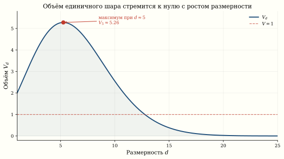
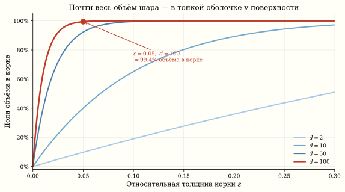
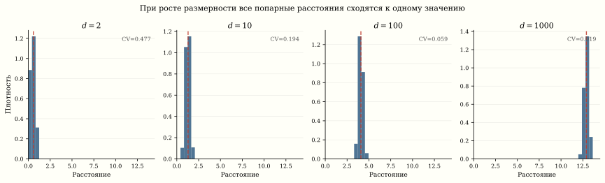

*Нейронная сеть с миллионами параметров минимизирует функцию потерь в пространстве, которое невозможно визуализировать. Что увидит человек, если «срежет» этот ландшафт плоскостью? Почему в пространстве тысяч измерений почти все точки — седловые, а не локальные минимумы? И есть ли смысл вообще «застрять» в плохом локальном минимуме?*

## Зачем проецировать ландшафт

Когда мы обучаем нейросеть, мы движемся по поверхности
$L(\theta)$, где $\theta \in \mathbb{R}^d$, а $d$ может быть
от десятков тысяч (LeNet) до сотен миллиардов (GPT-4).
Визуализировать такое пространство напрямую нельзя — мы
ограничены двумя или тремя измерениями на экране.

Идея Li et al.^[Li, Xu, Taylor, Studer, Goldstein. [Visualizing the Loss Landscape of Neural Nets](https://arxiv.org/abs/1712.09913), NeurIPS 2018.] проста:
возьмём обученные веса $\theta^*$, выберем случайные
направления $\delta_1, \delta_2 \in \mathbb{R}^d$ и посмотрим
на значение функции потерь вдоль них:

$$
f(\alpha, \beta) = L(\theta^* + \alpha\,\delta_1 + \beta\,\delta_2).
$$

Результат — двумерная «карта высот», которую можно нарисовать.

### Проекция на прямую

Простейший случай — одно направление:

$$
f(\alpha) = L(\theta^* + \alpha\,\delta), \quad \alpha \in [-1, 1].
$$

Если $\delta$ — случайный гауссов вектор, мы получаем
одномерный «срез» ландшафта. Для хорошо обученной сети
этот срез выглядит как гладкая парабола вблизи минимума,
но вдали от минимума — многомодально: встречаются плоские плато и острые пики.

::: {.callout-important title="Фильтр-нормализация"}
Чтобы сравнивать архитектуры честно, Li et al. предложили
нормализовать направления $\delta$ поканально: каждый фильтр
в свёрточном слое масштабируется до нормы соответствующего
фильтра в $\theta^*$. Без этого трюка масштаб весов искажает
картину, и все ландшафты выглядят одинаково.
:::

### Проекция на плоскость

Два случайных направления $\delta_1, \delta_2$ задают двумерное
сечение. Для ResNet-56 без skip-connections ландшафт оказывается
хаотичным с множеством глубоких впадин. Добавление residual
connections **драматически** сглаживает его — это одно из самых
наглядных объяснений того, *зачем* нужны skip-connections.

```{.python}
import torch
import numpy as np
import matplotlib.pyplot as plt
from mpl_toolkits.mplot3d import Axes3D

def project_loss_surface(model, loss_fn, data, n_points=51, scale=1.0):
    """Проецируем функцию потерь на случайную плоскость."""
    theta_star = {k: v.clone() for k, v in model.state_dict().items()}

    # Два случайных направления (filter-normalized)
    delta1, delta2 = {}, {}
    for k, v in theta_star.items():
        d1 = torch.randn_like(v)
        d2 = torch.randn_like(v)
        # Нормализация по фильтрам
        if v.dim() >= 2:
            for i in range(v.shape[0]):
                d1[i] *= v[i].norm() / (d1[i].norm() + 1e-10)
                d2[i] *= v[i].norm() / (d2[i].norm() + 1e-10)
        delta1[k] = d1
        delta2[k] = d2

    alphas = np.linspace(-scale, scale, n_points)
    betas  = np.linspace(-scale, scale, n_points)
    Z = np.zeros((n_points, n_points))

    for i, a in enumerate(alphas):
        for j, b in enumerate(betas):
            # θ* + α·δ₁ + β·δ₂
            new_state = {}
            for k in theta_star:
                new_state[k] = theta_star[k] + a * delta1[k] + b * delta2[k]
            model.load_state_dict(new_state)
            with torch.no_grad():
                Z[j, i] = loss_fn(model, data).item()

    model.load_state_dict(theta_star)
    return alphas, betas, Z

# Визуализация
# alphas, betas, Z = project_loss_surface(model, loss_fn, train_data)
# fig, ax = plt.subplots(subplot_kw={"projection": "3d"})
# A, B = np.meshgrid(alphas, betas)
# ax.plot_surface(A, B, Z, cmap="coolwarm", alpha=0.9)
# ax.set_xlabel("α"); ax.set_ylabel("β"); ax.set_zlabel("Loss")
```

Возьмите поверхность потерь в руки: тяните, чтобы крутить камеру, и кликните по ней, чтобы уронить шарик градиентного спуска — он сам скатится в ближайший минимум.

::: {.column-page}
```{=html}
<div data-sigma-widget="loss-landscape-3d"></div>
```
:::

## Парадоксы высокой размерности

Ландшафт функции потерь живёт в пространстве очень высокой
размерности. Наша геометрическая интуиция, выработанная в 2D и 3D,
систематически обманывает нас в таком мире.

### Парадокс 1: объём сферы

Объём единичного шара в $\mathbb{R}^d$:

$$
V_d = \frac{\pi^{d/2}}{\Gamma(d/2 + 1)}.
$$

При $d = 2$ это $\pi \approx 3.14$. При $d = 10$ — уже $2.55$.
При $d = 100$ — число $V_{100} \approx 2.37 \times 10^{-40}$
— это $\approx 2.6 \times 10^{39}$ раз меньше объёма атома водорода
($\approx 0.62\,\text{Å}^3$ при радиусе Бора $\approx 0.53\,\text{Å}$).
**Единичный шар в высоких измерениях пуст.**



### Парадокс 2: весь объём — у поверхности

Какая доля объёма шара радиуса $R$ лежит в тонкой корке
шириной $\varepsilon R$ у поверхности? Отношение:

::: {.column-page}
$$
\frac{V_d(R) - V_d(R - \varepsilon R)}{V_d(R)}
= 1 - (1-\varepsilon)^d.
$$
:::

При $d = 100$ и $\varepsilon = 0.05$ корка содержит
$1 - 0.95^{100} \approx 99.4\%$ всего объёма. В пространстве
параметров нейросети «внутренность» шара фактически пуста —
все точки прижаты к границе.



### Парадокс 3: все точки далеко друг от друга

Для $N$ точек, равномерно распределённых в единичном кубе $[0,1]^d$,
среднее расстояние между парой точек:

$$
\mathbb{E}[\|x_i - x_j\|] \approx \sqrt{d/6}.
$$

А дисперсия расстояний растёт как $O(1/d)$, то есть
**все попарные расстояния стремятся к одному и тому же
значению**. В $d = 10\,000$ разброс расстояний — доли
процента. Метрика расстояний теряет смысл.



::: {.column-margin}

::: {.callout-note title="Концентрация меры"}
Это явление формализуется **неравенством концентрации**.
Для стандартного гауссова вектора $g \sim \mathcal{N}(0, I_d)$:

::: {.column-page}
$$
\Pr\left[\left|\|g\| - \sqrt{d}\right| > t\right] \leq 2\exp\left(-\frac{t^2}{2}\right).
$$
:::

Норма случайного вектора в $\mathbb{R}^d$ сконцентрирована
около $\sqrt{d}$ с отклонением порядка $O(1)$. Гауссов вектор
в высоких измерениях лежит на тонкой сферической оболочке.
:::

:::

### Парадокс 4: седловые точки вместо локальных минимумов

В двумерном ландшафте локальный минимум — обычное дело:
обе кривизны положительны. Но в $d$-мерном пространстве
для стационарной точки нужно, чтобы **все** $d$ собственных
значений гессиана были одного знака. В модели, где знаки
собственных значений независимы и равновероятны (упрощение, но иллюстративное),
вероятность этого — $2^{-d}$.

Dauphin et al.^[Dauphin, Pascanu, Gulcehre, Cho, Ganguli, Bengio.
[Identifying and attacking the saddle point problem in high-dimensional non-convex optimization](https://arxiv.org/abs/1406.2572), NeurIPS 2014.]
показали, что в высокомерных нейросетях критические точки
с высоким значением loss — почти всегда седловые, а не
локальные минимумы. Настоящие локальные минимумы имеют
примерно одинаковое значение loss.

::: {.callout-important title="Закон Dauphin: все минимумы одинаково хороши"}
Плохих локальных минимумов в глубоких нейросетях почти нет.
Критические точки с высоким loss — **почти всегда сёдла**, а не ямы.
Все настоящие локальные минимумы сосредоточены вблизи одного и того же
уровня loss. Это означает: если SGD застрял — он застрял в седле,
а не в плохом минимуме. Нужно не «вылезать» — нужно **соскользнуть**.
:::

Это объясняет, почему SGD работает: ему не нужно «перепрыгивать»
через барьеры локальных минимумов — он просто «соскальзывает»
с седловых точек вдоль направлений отрицательной кривизны.

## Что показывают проекции

Когда мы проецируем $L(\theta)$ на случайную прямую или плоскость,
мы видим **типичное** сечение, а не специально выбранное.
Теорема Джонсона–Линденштраусса гарантирует, что случайная
проекция из $\mathbb{R}^d$ в $\mathbb{R}^k$ сохраняет попарные
расстояния $N$ точек с точностью $\varepsilon$ при
$k = O(\log N / \varepsilon^2)$ измерениях — для $N = 10\,000$
и $\varepsilon = 0.1$ достаточно $k \approx 1\,900$ измерений
(константа в оценке зависит от формулировки теоремы,
$k \approx 2\!-\!4\,\ln N / \varepsilon^2$) — вместо исходных тысяч;
при $d \sim 10^6$ это сжатие в сотни раз.

Но одномерный срез показывает только одно из миллиона
направлений. Гладкость среза не означает гладкости ландшафта:
может существовать узкое «ущелье» в ортогональном направлении.

### Что видно на практике

| Архитектура | Без skip-connections | С skip-connections |
|:--|:--|:--|
| Plain-56 / ResNet-56 | Множество острых минимумов | Один широкий бассейн |
| Plain-110 / ResNet-110 | Ещё более хаотичный | Идеально гладкий |

Skip-connections **выпрямляют** ландшафт, превращая его из
хаотической поверхности в почти выпуклую чашу вблизи решения.

## Практическое следствие: широкие минимумы обобщают лучше

Keskar et al.^[Keskar, Mudigere, Nocedal, Smelyanskiy, Tang.
[On Large-Batch Training for Deep Learning: Generalization Gap and Sharp Minima](https://arxiv.org/abs/1609.04836), ICLR 2017.]
заметили, что **широкие** минимумы (с малой кривизной гессиана)
обобщают лучше, чем **острые**. Маленький batch size в SGD
добавляет шум, который «выталкивает» оптимизатор из острых
минимумов в широкие — это одна из причин, почему SGD
обобщает лучше полного градиентного спуска.

На проекциях это видно буквально: ландшафт для SGD с batch 256
выглядит как широкая долина, а для полного GD — как узкий
каньон.

## Резюме

| Размерность | Интуиция 3D | Реальность $d \gg 1$ |
|:--|:--|:--|
| **Критические точки** | **Минимумы и максимумы** | **Почти все — сёдла** |
| Оптимизация | Застреваем в минимумах | Соскальзываем с сёдел |
| Объём шара | Большой | $\to 0$ экспоненциально |
| Расстояния | Разные | Все почти одинаковы |
| Случайная проекция | Теряет информацию | Сохраняет расстояния |

**Закон, который стоит унести:** все локальные минимумы глубокой сети примерно
одинаковы по качеству — плохие критические точки почти всегда сёдла, а не ямы.
Визуализация через проекции — мощный инструмент, но интерпретировать её нужно с
осторожностью: гладкость одного среза не гарантирует гладкости ландшафта целиком.
