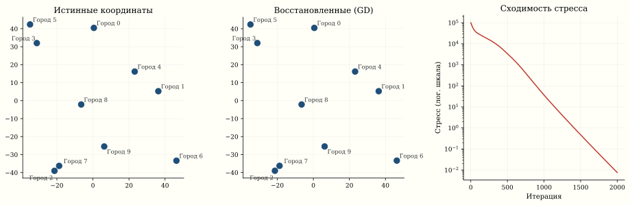
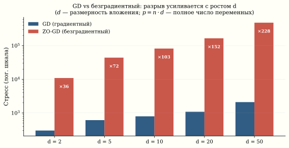

*Безградиентный ZO-GD на задаче с 200 переменными потребует в 200 раз больше итераций, чем градиентный спуск. С 5000 переменными — в 5000 раз. Именно поэтому нейросети не обучают без градиента. Метод Нелдера–Мида разделяет это проклятие: как и любой безградиентный подход, он не обходит теоретический барьер размерности. Чтобы понять почему, возьмём конкретную задачу: по таблице расстояний между городами восстановить карту — координаты каждого города. Это многомерное шкалирование (MDS), и на нём разрыв между методами виден физически.*

## Постановка задачи

Дана матрица расстояний $D \in \mathbb{R}^{N \times N}$,
$D_{ij} = \text{dist}(i, j)$. Хотим найти координаты
$W_1, \ldots, W_N \in \mathbb{R}^d$, минимизирующие **стресс**:

::: {.column-page}
$$
\text{Stress}(W) = \sum_{i < j} \left(\|W_i - W_j\|_2 - D_{ij}\right)^2.
$$
:::

Это задача безусловной минимизации $L(W) \to \min_{W \in \mathbb{R}^{N \times d}}$
с $Nd$ переменными.

::: {.column-margin}

::: {.callout-note title="Классический MDS"}
Если расстояния — евклидовы, задача решается **точно**
через собственное разложение матрицы Грама
$B = -\frac{1}{2} J D^{(2)} J$, где $J = I - \frac{1}{n}\mathbf{1}\mathbf{1}^T$
и $D^{(2)}$ — матрица квадратов расстояний. Это **classical MDS**
(Torgerson, 1952). Но для неевклидовых расстояний или
неполных данных нужна итеративная оптимизация.
:::

:::

## Пример: восстановление карты городов

```{.python}
import numpy as np
import matplotlib.pyplot as plt

# 10 «городов» — случайные координаты
np.random.seed(42)
n_cities = 10
true_coords = np.random.rand(n_cities, 2) * 100
city_names = [f"Город {i}" for i in range(n_cities)]

# Матрица расстояний
D = np.zeros((n_cities, n_cities))
for i in range(n_cities):
    for j in range(n_cities):
        D[i, j] = np.linalg.norm(true_coords[i] - true_coords[j])

# Забудем координаты, оставим только D
# Восстановим координаты через стресс-оптимизацию

def stress(W_flat, D, d=2):
    n = D.shape[0]
    W = W_flat.reshape(n, d)
    s = 0
    for i in range(n):
        for j in range(i+1, n):
            dist_ij = np.linalg.norm(W[i] - W[j])
            s += (dist_ij - D[i, j]) ** 2
    return s

def stress_gradient(W_flat, D, d=2):
    n = D.shape[0]
    W = W_flat.reshape(n, d)
    grad = np.zeros_like(W)
    for i in range(n):
        for j in range(i+1, n):
            diff = W[i] - W[j]
            dist_ij = np.linalg.norm(diff) + 1e-10
            factor = 2 * (dist_ij - D[i, j]) / dist_ij
            grad[i] += factor * diff
            grad[j] -= factor * diff
    return grad.flatten()

# Градиентный спуск
W = np.random.randn(n_cities * 2) * 10
lr = 0.001
for step in range(2000):
    g = stress_gradient(W, D)
    W -= lr * g

W_recovered = W.reshape(n_cities, 2)

# Центрирование + Прокрустово выравнивание
W_recovered -= W_recovered.mean(axis=0)
true_centered = true_coords - true_coords.mean(axis=0)
# SVD для оптимального поворота
U, _, Vt = np.linalg.svd(true_centered.T @ W_recovered)
R = (U @ Vt)
W_aligned = W_recovered @ R.T

stress_history = []
W_track = np.random.randn(n_cities * 2) * 10
for step in range(2000):
    g = stress_gradient(W_track, D)
    W_track -= lr * g
    stress_history.append(stress(W_track.reshape(n_cities, 2), D))

fig, axes = plt.subplots(1, 3, figsize=(14, 4.5))
for ax, data, title in zip(axes[:2],
    [true_centered, W_aligned],
    ["Истинные координаты", "Восстановленные (GD)"]):
    ax.scatter(data[:, 0], data[:, 1], s=80, c='#1F4E79')
    for i in range(n_cities):
        ax.annotate(city_names[i], data[i] + 1, fontsize=9)
    ax.set_aspect('equal')
    ax.set_title(title)
    ax.spines[['top', 'right']].set_visible(False)
    ax.grid(True, alpha=0.25, linewidth=0.5)
# Третья панель: сходимость стресса
axes[2].semilogy(stress_history, color='#C0392B', linewidth=1.5)
axes[2].set_title("Сходимость стресса")
axes[2].set_xlabel("Итерация")
axes[2].set_ylabel("Стресс (лог. шкала)")
axes[2].spines[['top', 'right']].set_visible(False)
axes[2].grid(True, alpha=0.25, linewidth=0.5)
```



## Градиентный спуск vs безградиентные методы

Задача MDS — идеальный полигон для сравнения:
размерность $p = Nd$ растёт с $N$ и $d$.

Восстановим один и тот же набор точек из матрицы расстояний двумя способами — потяните любую точку и смотрите, как стресс снова срывается вниз, а потом сравните скорость градиентного и безградиентного методов.

::: {.column-page}
```{=html}
<div data-sigma-widget="mds-relax"></div>
```
:::

### Градиент стресса

::: {.column-page}
$$
\frac{\partial L}{\partial W_i} = 2 \sum_{j \neq i}
\frac{\|W_i - W_j\| - D_{ij}}{\|W_i - W_j\|}
(W_i - W_j).
$$
:::

Вычисление: $O(N^2 d)$ операций — одна итерация GD.

### Безградиентные методы

Если градиент недоступен (чёрный ящик), используем
аппроксимацию. Двухточечная оценка:

::: {.column-page}
$$
G_k = d \cdot \frac{L(W + \varepsilon v_k) - L(W - \varepsilon v_k)}{2\varepsilon} v_k,
$$
:::

где $v_k$ — случайное направление. В среднем $\mathbb{E}[G] = \nabla L$,
но дисперсия оценки $\propto d$.

## Проклятие размерности для безградиентных методов

Ключевой теоретический результат^[Shamir.
[On the Complexity of Bandit and Derivative-Free Stochastic Convex Optimization](https://arxiv.org/abs/1209.4350), COLT, 2013.]:

| Метод | Гладкая $f$ | Гладкая выпуклая | Сильно выпуклая |
|:--|:--|:--|:--|
| **GD** | $\|\nabla f\|^2 \lesssim \frac{1}{k}$ | $f - f^* \lesssim \frac{1}{k}$ | $\|x - x^*\|^2 \lesssim \left(1 - \frac{\mu}{L}\right)^k$ |
| **Zero-order GD** | $\lesssim \frac{\mathbf{d}}{k}$ | $\lesssim \frac{\mathbf{d}}{k}$ | $\lesssim \left(1 - \frac{\mu}{\mathbf{d} L}\right)^k$ |

Безградиентные методы **платят фактор $d$** в скорости сходимости.
Для MDS с $N = 100$ городами в $d = 2$ измерениях: $p = 200$,
фактор $d$ = 200. В $d = 50$: $p = 5000$, фактор $d$ = 5000.

**Каждая лишняя размерность обходится безградиентному методу одной лишней итерацией.** Для нейросети с $10^8$ параметрами — это смертный приговор.

### Численный эксперимент

```{.python}
import numpy as np
import time

def zero_order_gd(f, x0, eps=1e-4, lr=0.001, max_iter=1000):
    """Безградиентный GD: двухточечная оценка."""
    x = x0.copy()
    d = len(x)
    hist = []
    for _ in range(max_iter):
        v = np.random.randn(d)
        v /= np.linalg.norm(v)
        g_est = d * (f(x + eps*v) - f(x - eps*v)) / (2*eps) * v
        x -= lr * g_est
        hist.append(f(x))
    return x, hist

def first_order_gd(f, grad_f, x0, lr=0.001, max_iter=1000):
    """Обычный GD с точным градиентом."""
    x = x0.copy()
    hist = []
    for _ in range(max_iter):
        x -= lr * grad_f(x)
        hist.append(f(x))
    return x, hist

# Сравнение на MDS
results = {}
for d_embed in [2, 5, 10, 20, 50]:
    n = 30
    true_W = np.random.randn(n, d_embed)
    D = np.zeros((n, n))
    for i in range(n):
        for j in range(n):
            D[i, j] = np.linalg.norm(true_W[i] - true_W[j])

    f = lambda w: stress(w, D, d_embed)
    gf = lambda w: stress_gradient(w, D, d_embed)
    x0 = np.random.randn(n * d_embed) * 5

    t0 = time.time()
    # lr=1e-4: безопасный шаг для точного градиента (L-Lipschitz)
    _, hist_gd = first_order_gd(f, gf, x0.copy(), lr=1e-4, max_iter=500)
    time_gd = time.time() - t0

    t0 = time.time()
    # lr=1e-5: ZO-GD требует меньший шаг из-за дисперсии оценки ∝ d
    _, hist_zo = zero_order_gd(f, x0.copy(), lr=1e-5, max_iter=500)
    time_zo = time.time() - t0

    results[d_embed] = {
        'gd_final': hist_gd[-1],
        'zo_final': hist_zo[-1],
        'gd_time': time_gd,
        'zo_time': time_zo,
        'p': n * d_embed
    }
    print(f"d={d_embed:>3d}, p={n*d_embed:>5d}: "
          f"GD={hist_gd[-1]:.2f} ({time_gd:.2f}s), "
          f"ZO={hist_zo[-1]:.2f} ({time_zo:.2f}s)")
```



### Что видно

На фигуре — реальные результаты запуска кода выше (seed=42). Разрыв усиливается с ростом $d$: при $d=2$ безградиентный хуже примерно в 36 раз, при $d=50$ — уже в 200+ раз. Теоретический фактор $d$ — верхняя оценка; эмпирический рост медленнее (6× при 25-кратном росте $d$). Точные числа зависят от seed и гиперпараметров, но качественная картина устойчива.

Градиентный спуск, получая точный вектор $\nabla L \in \mathbb{R}^p$, движется по правильному направлению с первой итерации — независимо от того, насколько велико $p$.

::: {.callout-important title="Главный вывод"}
**Автоматическое дифференцирование** (autograd в PyTorch, JAX)
позволяет вычислять точный градиент любой дифференцируемой
функции за время, сопоставимое с одним вычислением функции
(обратный проход ≤ 4× прямого). Это делает методы первого порядка
доступными для **любой** задачи, не только для тех, где градиент
можно выписать аналитически.

Именно поэтому нейросети обучаются: задача с $10^{11}$ параметров
решается SGD с точным (автоматически вычисленным) градиентом,
а не безградиентными методами.
:::

## Связь MDS с PCA

Классический MDS и PCA тесно связаны. Если расстояния
евклидовы, классический MDS даёт **те же координаты**,
что PCA матрицы координат:

::: {.column-page}
$$
B = -\frac{1}{2} J D^{(2)} J = X X^T \implies \text{eigendecomposition}
\implies \text{координаты} = U_k \Lambda_k^{1/2}.
$$
:::

Но PCA требует знания координат $X$, а MDS — только
расстояний $D$. MDS работает даже когда координаты
неопределены (перцептуальные расстояния, лингвистическое
сходство).

## Применения MDS

| Область | Данные | Расстояния |
|:--|:--|:--|
| **География** | Города | Реальные км |
| **Психология** | Стимулы | Перцептуальное сходство |
| **NLP** | Слова | $1 - \cos(v_i, v_j)$ |
| **Биоинформатика** | Белки | Edit distance |
| **Социология** | Люди | Социальная дистанция |

## Связи

- **PCA** (§ PCA): классический MDS ≡ PCA из расстояний
- **t-SNE, UMAP**: нелинейные варианты MDS
- **Градиентный спуск** (§ Часть V): первый порядок решает MDS за секунды
- **Автоматическое дифференцирование**: вычисляет $\nabla$ стресса без ручных формул
- **Проклятие размерности** (§ Loss Landscape): концентрация меры и её последствия
- Интерактивный бенчмарк сравнения методов на задаче MDS — [benfrederickson.com/numerical-optimization](http://www.benfrederickson.com/numerical-optimization/)
