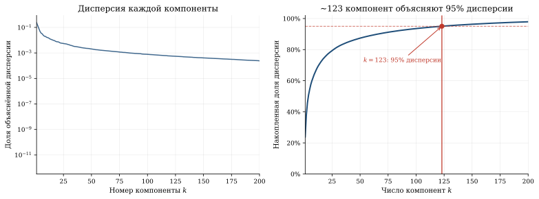
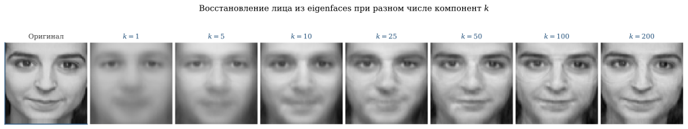

*Фотография лица — это вектор из 4096 пикселей. Но лица не занимают всё это пространство: они лежат на тонком многообразии значительно меньшей размерности. Метод главных компонент (PCA) находит это многообразие — и оказывается, что для узнавания лица достаточно 50—100 «собственных лиц» (eigenfaces).*

## Идея PCA

Дана матрица данных $X \in \mathbb{R}^{n \times d}$ — $n$
объектов, каждый описан $d$ признаками. PCA ищет линейную
проекцию в пространство меньшей размерности $k \ll d$,
сохраняющую максимум информации (дисперсии).

### Формулировка

Центрируем данные: $\bar{X} = X - \frac{1}{n}\mathbf{1}\mathbf{1}^T X$.

Ковариационная матрица:
$$
C = \frac{1}{n-1} \bar{X}^T \bar{X} \in \mathbb{R}^{d \times d}.
$$

PCA — это собственное разложение:

::: {.column-page}
$$
C = V \Lambda V^T, \quad \Lambda = \text{diag}(\lambda_1, \ldots, \lambda_d),
\quad \lambda_1 \geq \lambda_2 \geq \ldots \geq \lambda_d \geq 0.
$$
:::

Столбцы $V$ — **главные компоненты** — направления максимальной дисперсии.
$\lambda_i$ — дисперсия данных вдоль $i$-й компоненты.

### Связь с SVD

Если $\bar{X} = U \Sigma V^T$ (SVD), то:

::: {.column-page}
$$
C = \frac{1}{n-1} V \Sigma^2 V^T \implies \lambda_i = \frac{\sigma_i^2}{n-1}.
$$
:::

PCA — это SVD центрированных данных. На практике SVD
вычислительно стабильнее, чем прямое собственное разложение.

## Eigenfaces: узнавание лиц

Turk и Pentland^[Turk, Pentland. [Eigenfaces for Recognition](https://doi.org/10.1162/jocn.1991.3.1.71), Journal of Cognitive Neuroscience, 1991.]
предложили представлять лица как линейные комбинации
«собственных лиц» — главных компонент набора фотографий.

### Как это работает

**1. Сбор данных.** $n$ фотографий лиц размера $h \times w$,
каждая развёрнута в вектор длины $d = hw$. Формируем матрицу
$X \in \mathbb{R}^{n \times d}$.

**2. PCA.** Находим $k$ главных компонент $v_1, \ldots, v_k$.
Каждая $v_i \in \mathbb{R}^d$ может быть развёрнута обратно
в картинку $h \times w$ — это и есть **eigenface**.

**3. Кодирование.** Лицо $x$ проецируется:
$$
w = V_k^T (x - \bar{x}) \in \mathbb{R}^k.
$$
Вектор $w$ — «координаты» лица в пространстве eigenfaces.

**4. Распознавание.** Для нового лица вычисляем $w$ и находим
ближайшего соседа среди хранимых проекций.

**5. Восстановление.** Приближённое лицо:
$$
\hat{x} = \bar{x} + V_k w = \bar{x} + \sum_{i=1}^k w_i v_i.
$$

Парадокс шага 2: чтобы узнать лицо, нужно сначала **вычесть среднее лицо**. Eigenfaces — это не портреты, а *разности лиц*; без центрирования метод не работает. Именно поэтому среднее лицо (первая картинка ниже) выглядит как размытый призрак: это точка отсчёта, от которой считаются все остальные лица.


### Scree plot: сколько компонент достаточно?



### Восстановление с разным числом компонент



Покрутите сами на **настоящих** лицах из датасета Olivetti: двигайте число компонент $k$ — лицо пересобирается из собственных лиц прямо на глазах. Уже при $k = 25$ лицо узнаваемо, хотя вместо 4096 пикселей хранится лишь $k$ чисел.

::: {.column-page}
```{=html}
<div data-sigma-widget="pca-eigenfaces"></div>
```
:::

::: {.column-margin}

::: {.callout-note title="Почему eigenfaces работают"}
Лица структурно похожи: два глаза, нос, рот в фиксированных
пропорциях. Поэтому пространство лиц — тонкое многообразие
в пиксельном пространстве. PCA находит его линейное приближение.
Первые eigenfaces ловят освещение и общую форму, средние —
детали лица (глаза, брови), последние — шум.
:::

:::

::: {.callout-tip title="Суть"}
Лицо — это вектор из 4096 пикселей, но *реальное* разнообразие лиц укладывается примерно в 123 числа: именно столько компонент PCA описывают 95% дисперсии датасета Olivetti. Данные с внутренней структурой занимают ничтожную долю доступного пространства — **PCA находит это многообразие**. Turk и Pentland в 1991 году показали: для распознавания лица хватает 50—100 чисел.
:::

## Обобщение

Тот же трюк работает для любых однотипных изображений — котиков, рентгенов, спутниковых снимков. Единственное условие: объекты должны быть структурно похожи, тогда у них найдётся общая «ось вариации». Для лиц это освещение, поза, выражение. PCA не знает, что именно кодирует, — он просто находит **направления, вдоль которых данные наиболее разнообразны**.

## PCA в других задачах

### Финансы: факторная модель

Матрица доходностей $d$ акций за $n$ дней: $X \in \mathbb{R}^{n \times d}$.
PCA выделяет **факторы**. Первая компонента, как правило, почти
повторяет рыночный индекс — общее движение всего рынка сразу.
Дальше идут более узкие эффекты: отраслевые, разница между growth
и value, размер компании. Их порядок не закреплён и меняется
от рынка к рынку и от периода к периоду.

```{.python}
# Пример: случайные доходности с общим фактором
np.random.seed(42)
n_stocks, n_days = 50, 252

market = np.random.randn(n_days) * 0.01          # рыночный фактор
sector = np.random.randn(n_days) * 0.005          # секторный фактор
betas_m = np.random.uniform(0.5, 1.5, n_stocks)   # чувствительность к рынку
betas_s = np.random.randn(n_stocks) * 0.3          # чувствительность к сектору
noise = np.random.randn(n_days, n_stocks) * 0.003  # идиосинкратический шум

returns = (market[:, None] * betas_m[None, :]
         + sector[:, None] * betas_s[None, :]
         + noise)

pca_fin = PCA(n_components=5)
pca_fin.fit(returns)
print("Доля дисперсии по компонентам:")
for i, ev in enumerate(pca_fin.explained_variance_ratio_[:5]):
    print(f"  PC{i+1}: {ev:.1%}")
# PC1 ≈ 60-70% (рыночный фактор)
# PC2 ≈ 5-10%  (секторный фактор)
# PC3+: шум
```

### Геномика: популяционная структура

PCA матрицы генотипов ($n$ людей × $d$ SNP) выявляет
популяционную структуру: европейцы, азиаты, африканцы
чётко разделяются в первых двух компонентах^[Price et al.
[Principal components analysis corrects for stratification in genome-wide association studies](https://doi.org/10.1038/ng1847), Nature Genetics, 2006.].

### Климатология: EOF-анализ

Empirical Orthogonal Functions (EOF) — это PCA для
пространственно-временных данных. Если ряды температуры
не очищать от тренда, потепление обычно проступает уже в первой
EOF. Но ставить знак равенства между первой EOF и «трендом
потепления» нельзя: она смешивает тренд с естественной
изменчивостью (в первую очередь с Эль-Ниньо) и чисто их
не разделяет^[[Introduction to EOFs](https://projectpythia.org/eofs-cookbook/notebooks/eof-intro),
EOFs Cookbook, Project Pythia.].

## PCA на чистом шуме

Допустим, первая главная компонента объясняет 30% дисперсии. Прежде чем считать это
структурой, стоит спросить: сколько объяснил бы чистый шум? Возьмём матрицу из
независимого гауссова шума. Истинная ковариация у такого шума — единичная матрица, так что
все собственные значения должны быть около единицы. Но при конечном числе наблюдений
выборочные собственные значения **растекаются** по отрезку $[\lambda_-, \lambda_+]$, $\lambda_\pm = (1\pm\sqrt{\gamma})^2$,
где $\gamma = d/n$ — отношение числа признаков к числу объектов. Это закон
**Марченко–Пастура**. Наибольшее собственное
значение заметно больше единицы и легко сходит за «сильную компоненту», хотя никакого
сигнала в данных нет.

Чем меньше объектов $n$ приходится на признак (больше $\gamma$), тем шире разброс и тем выше
этот артефакт. Настоящий сигнал, заложенный в данные, отличим от шума, только если его
собственное значение **пробивает правый край** $\lambda_+$; это и называют фазовым переходом
BBP. В виджете можно добавить сигнал ранга 1 и проследить, при какой силе он выходит
за «полумесяц» шума. Число признаков там подписано буквой $p$ — это то же самое $d$.

::: {.column-page}
```{=html}
<div data-sigma-widget="pca-noise"></div>
```
:::

Практический вывод: **scree-график шума не плоский.** Прежде чем верить в «структуру»,
сравните спектр с нулевой моделью — кривой Марченко–Пастура или перемешиванием признаков
(permutation test). Только компоненты выше шумового края несут сигнал.

## Не только лица: eigencats

Хорошая проверка на честность: если метод и правда про однородные объекты, а
не про лица конкретно, он обязан сработать на любом другом однотипном наборе.
Берём открытый набор фотографий кошачьих морд, приведённых к одному размеру,
и повторяем тот же эксперимент.


Картина повторяется качественно: первые компоненты забирают себе самое грубое —
общую освещённость и разворот головы, дальше идут форма морды и уши. Точного числа
компонент мы здесь не называем: scree-график для котов не строили. Важно другое —
кот, как и лицо, описывается небольшим набором координат вместо всех пикселей.

Вывод сильнее, чем кажется. **Пространство «реальных» объектов почти всегда узкое** —
лица, морды котов, рукописные цифры, фотографии природы: настоящие данные
занимают в своём огромном пространстве крошечное подпространство. Распознавание
и есть «найти это подпространство и работать внутри него». Отсюда прямая
дорога к автокодировщикам и эмбеддингам: PCA — самая ранняя и самая понятная
версия той же мысли.

## Ограничения PCA

1. **Линейность.** PCA находит только линейные зависимости.
   Для нелинейных многообразий (swiss roll) нужны kernel PCA,
   t-SNE, UMAP.

2. **Чувствительность к масштабу.** Признак с большой дисперсией
   доминирует. Решение: нормализация (z-score).

3. **Компоненты не интерпретируемы.** Eigenfaces — смесь
   освещения, позы, формы. Для интерпретируемости используют
   NMF (неотрицательная факторизация) или sparse PCA.

4. **Унимодальность.** PCA предполагает, что данные лежат вблизи одного линейного подпространства. При двумодальном распределении (например, смешанная популяция мужчин и женщин) среднее — размытая химера между двумя модами. Решение: GMM или раздельный PCA по классам.

## Связи

- [**SVD**](ch_linalg_3_singulyarnoe-razlozhenie-svd-gla.html) — PCA это и есть SVD центрированных данных
- [**ICA**](story_ica.html) — там ищут независимость, здесь хватает некоррелированности
- [**Тяжёлые хвосты**](story_heavy_tails.html) — почему «средний объект» иногда не значит ничего
- **t-SNE, UMAP** — нелинейные альтернативы, когда многообразие не плоское
