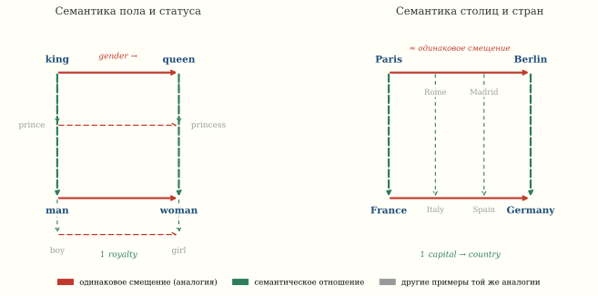

*Модель никогда не видела определений слов и не знала грамматики — только статистику соседей. Тем не менее расстояние от вектора «Токио» до «Японии» примерно равно расстоянию от «Берлина» до «Германии». В 2013 году Томас Миколов из Google показал, что если обучить простую нейросеть предсказывать контекст слова, то побочный продукт обучения — векторные представления слов — кодирует семантические отношения как направления: вычитаем из «короля» «мужчину», прибавляем «женщину» — получаем «королеву».*



## Дистрибутивная гипотеза

> «Вы узнаете слово по его окружению.»
> — Дж. Р. Фёрс, 1957

Идея восходит к лингвисту Фёрсу: значение слова определяется
тем, какие слова стоят рядом с ним в текстах. «Кошка» и «собака»
появляются в похожих контекстах (любит, ест, спит, хозяин),
а «кошка» и «интеграл» — в совершенно разных.

До Word2Vec эту идею реализовывали через подсчёт сопутствующих слов
(матрица коокуренций), SVD этой матрицы, и латентно-семантический
анализ (LSA, Deerwester et al., 1990). Но SVD матрицы
$|V| \times |V|$ при словаре $|V| = 100\,000$ — дорого.

## Архитектуры Word2Vec

Миколов предложил две архитектуры^[Mikolov, Chen, Corrado, Dean.
[Efficient Estimation of Word Representations in Vector Space](https://arxiv.org/abs/1301.3781), 2013.]:

### CBOW (Continuous Bag of Words)

По контексту (окружающим словам) предсказываем центральное слово:

::: {.column-page}
$$
\hat{w}_t = \arg\max_w P(w \mid w_{t-c}, \ldots, w_{t-1}, w_{t+1}, \ldots, w_{t+c})
$$
:::

Модель усредняет векторы контекстных слов и пропускает через
линейный слой + softmax.

### Skip-gram

Наоборот: по центральному слову предсказываем каждое из контекстных:

::: {.column-page}
$$
\max_\theta \sum_{t=1}^{T} \sum_{-c \leq j \leq c,\, j \neq 0}
\log P(w_{t+j} \mid w_t; \theta)
$$
:::

Skip-gram работает лучше для редких слов, CBOW — быстрее
и лучше для частых.

### Negative Sampling

Вычислять softmax по словарю из $10^5$ слов — дорого.
Трюк Миколова: вместо полного softmax обучаем бинарный
классификатор, который отличает настоящие пары (слово, контекст)
от случайных «негативных» пар:

::: {.column-page}
$$
\log \sigma(v_w^T v_c) + \sum_{i=1}^{k} \mathbb{E}_{w_i \sim P_n}
\left[\log \sigma(-v_{w_i}^T v_c)\right],
$$
:::

где $\sigma$ — сигмоида, $k \approx 5{-}20$ негативных примеров,
$P_n(w) \propto f(w)^{3/4}$ — сглажённое распределение частот.

## Магия аналогий

После обучения на большом корпусе (Google News, ~100 миллиардов
слов) векторы слов приобретают структуру:
**семантические отношения кодируются как направления**.

### Король − Мужчина + Женщина ≈ Королева

::: {.column-page}
$$
\vec{v}_{\text{king}} - \vec{v}_{\text{man}} + \vec{v}_{\text{woman}}
\approx \vec{v}_{\text{queen}}
$$
:::

Это работает, потому что вектор $\vec{v}_{\text{king}} - \vec{v}_{\text{man}}$
кодирует «быть мужского рода при власти», а прибавление $\vec{v}_{\text{woman}}$
переводит эту точку в женский вариант той же роли.

Выберите слова **a − b + c** и тащите любую точку-слово мышью — параллелограмм аналогии и ближайшее слово к результату перестраиваются прямо под пальцем.

::: {.column-page}
```{=html}
<div data-sigma-widget="word2vec-analogy"></div>
```
:::

### Париж − Франция + Германия ≈ Берлин

::: {.column-page}
$$
\vec{v}_{\text{Paris}} - \vec{v}_{\text{France}} + \vec{v}_{\text{Germany}}
\approx \vec{v}_{\text{Berlin}}
$$
:::

Разность «Париж − Франция» ≈ «столица_из» — направление,
кодирующее отношение «город → страна».

::: {.column-margin}

::: {.callout-tip title="Закон сюжета"}
Нейросеть не учили понимать аналогии — она вынуждена была сжать язык в
пространство, где арифметика работает. Это не фокус — это неизбежное
следствие дистрибутивной гипотезы в непрерывном пространстве.
:::

:::

Почему именно ~300 измерений? По теореме Джонсона–Линденштрауса $n$ точек
в $\mathbb{R}^d$ сохраняют попарные расстояния с погрешностью $\varepsilon$
при $d = O(\varepsilon^{-2} \log n)$. Для словаря в 3 миллиона слов это
даёт несколько сотен измерений — не магия, а теорема.

### Таблица аналогий

Каждая строка читается как $a - b + c \approx d$ — та же арифметика,
что в форме виджета выше.

| Отношение | $a$ | $b$ | $c$ | $d$ (найдено) |
|:--|:--|:--|:--|:--|
| Пол | king | man | woman | queen |
| Столица | Paris | France | Germany | Berlin |
| Пол (рус.) | король | мужчина | женщина | королева |
| Время глагола | walking | walked | swimming | swam |
| Сравнительная степень | bigger | big | small | smaller |
| Валюта | yen | Japan | Russia | ruble |

```{.python}
import gensim.downloader as api

# Загрузка предобученной модели (300-мерные вектора)
model = api.load("word2vec-google-news-300")

# Классическая аналогия
result = model.most_similar(
    positive=["king", "woman"],
    negative=["man"],
    topn=3
)
print("king - man + woman =")
for word, score in result:
    print(f"  {word}: {score:.4f}")
# king - man + woman =
#   queen: 0.7118
#   monarch: 0.6189
#   princess: 0.5902

# Географическая аналогия
result = model.most_similar(
    positive=["Paris", "Germany"],
    negative=["France"],
    topn=3
)
print("\nParis - France + Germany =")
for word, score in result:
    print(f"  {word}: {score:.4f}")
# Paris - France + Germany =
#   Berlin: 0.7331
#   Munich: 0.5624
#   Hamburg: 0.5114
```

## Почему это работает: геометрия

Levy и Goldberg^[Levy, Goldberg. [Neural Word Embedding as Implicit Matrix Factorization](https://papers.nips.cc/paper_files/paper/2014/hash/b78666971ceae55a8e87efb7cbfd9ad4-Abstract.html), NeurIPS 2014.]
показали, что Word2Vec с negative sampling неявно факторизует
матрицу поточечной взаимной информации (PMI):

$$
\vec{v}_w \cdot \vec{v}_c \approx \text{PMI}(w, c) - \log k,
$$

где $\text{PMI}(w, c) = \log \frac{P(w, c)}{P(w)P(c)}$.

Аналогии работают, потому что в пространстве PMI отношения
типа «столица-страна» статистически регулярны: слова «Париж»
и «Берлин» появляются в похожих контекстах (правительство,
парламент, столица), слова «Франция» и «Германия» — тоже
(страна, экономика, население), а разность PMI оказывается
приблизительно постоянной.

## Визуализация: t-SNE проекция

300-мерные векторы можно спроецировать на плоскость
с помощью t-SNE (van der Maaten, Hinton, 2008), сохраняющей
локальные расстояния:

```{.python}
import numpy as np
from sklearn.manifold import TSNE
import matplotlib.pyplot as plt

words = [
    # Страны и столицы
    "France", "Paris", "Germany", "Berlin",
    "Italy", "Rome", "Spain", "Madrid",
    "Japan", "Tokyo", "Russia", "Moscow",
    # Королевская семья
    "king", "queen", "prince", "princess",
    "man", "woman", "boy", "girl",
    # Еда
    "pizza", "sushi", "burger", "pasta",
]

vectors = np.array([model[w] for w in words])
tsne = TSNE(n_components=2, random_state=42, perplexity=8)
coords = tsne.fit_transform(vectors)

plt.figure(figsize=(12, 8))
for i, word in enumerate(words):
    plt.scatter(coords[i, 0], coords[i, 1], s=50, c='steelblue')
    plt.annotate(word, (coords[i, 0] + 0.5, coords[i, 1] + 0.5),
                 fontsize=11)

# Стрелки аналогий
for a, b in [("France", "Paris"), ("Germany", "Berlin"),
             ("king", "queen"), ("man", "woman")]:
    ia, ib = words.index(a), words.index(b)
    plt.annotate("", xy=coords[ib], xytext=coords[ia],
                 arrowprops=dict(arrowstyle="->", color="crimson",
                                 lw=1.5))
plt.title("t-SNE проекция Word2Vec")
plt.axis("off")
```

::: {.column-margin}

::: {.callout-note title="Ограничения аналогий"}
Не все аналогии работают одинаково хорошо. Mikolov et al.
предложили тест из 19 544 вопросов в 14 категориях
(семантических и синтаксических). Accuracy на этом тесте —
около 60—75% для лучших моделей. Аналогии типа
«муж − жена + бабушка = ?» часто дают неправильный ответ,
потому что отношения не всегда линейны.
:::

:::

## От Word2Vec к современным эмбеддингам

Word2Vec — **статический** эмбеддинг: каждому слову
соответствует ровно один вектор, вне зависимости от контекста.
Слово «банк» в «денежный банк» и «берег реки» получает
одно и то же представление.

**Контекстуальные эмбеддинги** (ELMo, 2018; BERT, 2019;
GPT) решают эту проблему: вектор слова зависит от всего
предложения. Каждый слой Transformer порождает свой
набор эмбеддингов, и один и тот же токен в разных контекстах
получает разные координаты.

Идея Word2Vec — **слова живут в геометрическом пространстве,
где близость означает семантическое сходство** — стала фундаментом,
на котором BERT и GPT построили контекстуальные представления.

## Численный эксперимент: обучение с нуля

```{.python}
from gensim.models import Word2Vec
from gensim.utils import simple_preprocess

# Корпус: русская Википедия (упрощённый пример)
sentences = [
    simple_preprocess("Москва столица России"),
    simple_preprocess("Берлин столица Германии"),
    simple_preprocess("Париж столица Франции"),
    simple_preprocess("Лондон столица Великобритании"),
    simple_preprocess("Россия большая страна"),
    simple_preprocess("Германия европейская страна"),
    simple_preprocess("Франция европейская страна"),
    # ... нужны миллионы предложений для хороших эмбеддингов
]

model = Word2Vec(
    sentences,
    vector_size=100,   # размерность вектора
    window=5,          # окно контекста
    min_count=1,       # минимальная частота слова
    sg=1,              # 1 = skip-gram, 0 = CBOW
    negative=5,        # число негативных примеров
    epochs=100,
)

# Для осмысленных аналогий нужен корпус ≥ 100M слов
# На малом корпусе результаты будут шумные
```

## Связи

- [**SVD**](ch_linalg_3_singulyarnoe-razlozhenie-svd-gla.html) — Word2Vec это почти факторизация матрицы PMI
- [**Внимание**](story_attention.html) — следующий шаг: эмбеддинг перестаёт быть фиксированным и начинает зависеть от контекста
- [**Ландшафт функции потерь**](story_loss_landscape.html) — почему 300 измерений хватает на словарь в миллионы слов
- **t-SNE** — нелинейная проекция, чтобы посмотреть на всё это глазами
